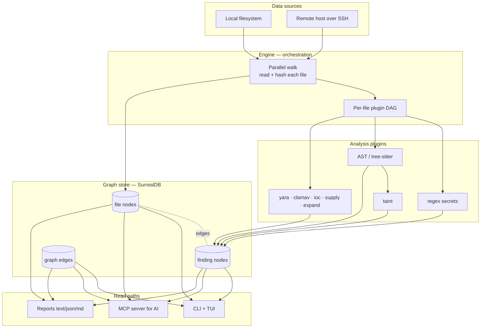

# exfill Architecture Guide

A multi-page tour of how **exfill** is built — written for someone new to Rust.
Every page explains *what* a component does, *why* it is shaped that way, and
*how* the Rust works, with links straight into the source (`crate/file.rs:line`).

exfill is an **offline, cross-platform, plugin-based filesystem-analysis and
SAST engine**. It walks a directory tree (or a remote host over SSH), reads each
file once, runs a set of analysis plugins over it, and stores every result in an
embedded graph database you can then query, navigate, and report on.

## How to read this guide

Start at the top and go down — each page assumes the ones above it. If you are
brand new to Rust, keep the [Rust primer](./rust-primer.md) open in a second tab;
every page links into it when it uses an idiom for the first time.

| # | Page | What it covers |
|---|------|----------------|
| 0 | [Overview & layers](./overview.md) | The whole system as layers; the crate map; how a scan flows end to end |
| 1 | [The plugin DAG](./pipeline.md) | `FileTask`, `Artifact`, and the `Pipeline` that schedules plugins by data type |
| 2 | [**The engine**](./engine.md) | The heart: parallel walk, incremental rescan, archive expansion, remote scans |
| 3 | [**The AST scanner**](./ast.md) | tree-sitter parsing, the `LangSpec` table, dangerous-call detection, 12 languages |
| 4 | [Taint analysis](./taint.md) | Following untrusted input into dangerous sinks |
| 5 | [The other scanners](./scanners.md) | regex secrets, archive expand, IOC, supply-chain, ClamAV, YARA |
| 6 | [The graph store](./store.md) | SurrealDB, content-addressed records, graph edges, garbage collection |
| 7 | [CLI, TUI & navigator](./cli-tui.md) | Commands, the mutt-style TUI, the vim-style graph navigator |
| 8 | [Integrations](./integrations.md) | MCP server, LLM enrichment, Rhai scripting, remote SSH, reporting |
| 9 | [Rust primer](./rust-primer.md) | Every Rust concept the codebase uses, explained from scratch |

## The one-paragraph version

The engine ([`exfill-engine`](./engine.md)) walks the filesystem on many threads.
For each file it builds a [`Pipeline`](./pipeline.md) of plugins — small objects
that each declare "I turn *this* kind of data into *that* kind of data." The
pipeline sorts itself so every plugin runs after its inputs exist, with no plugin
ever calling another directly. Results become **findings**, which the engine
writes into a [graph store](./store.md). You then read them back through the
[CLI, TUI](./cli-tui.md), an [MCP server](./integrations.md) for AI agents, or a
[report](./integrations.md).

## The mental model in one diagram

Read on: **[Overview & layers →](./overview.md)**
