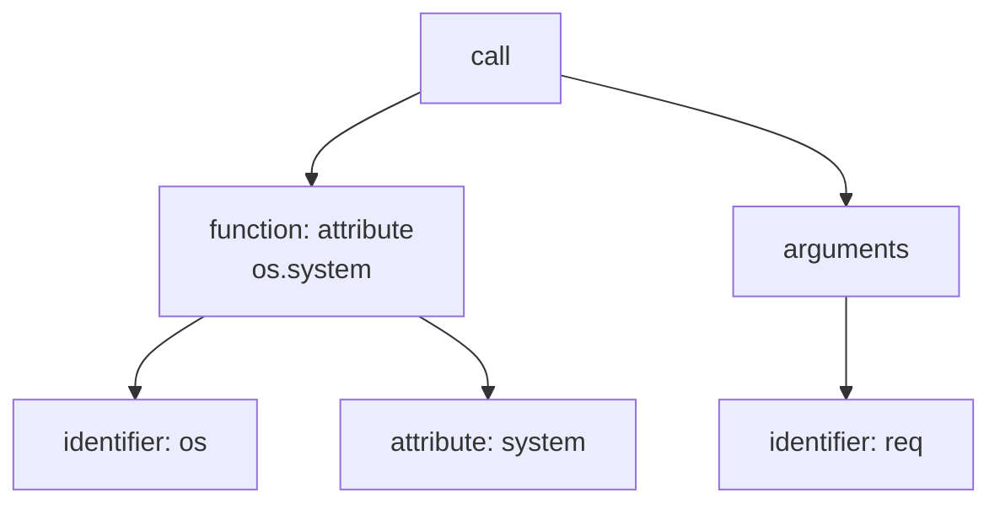
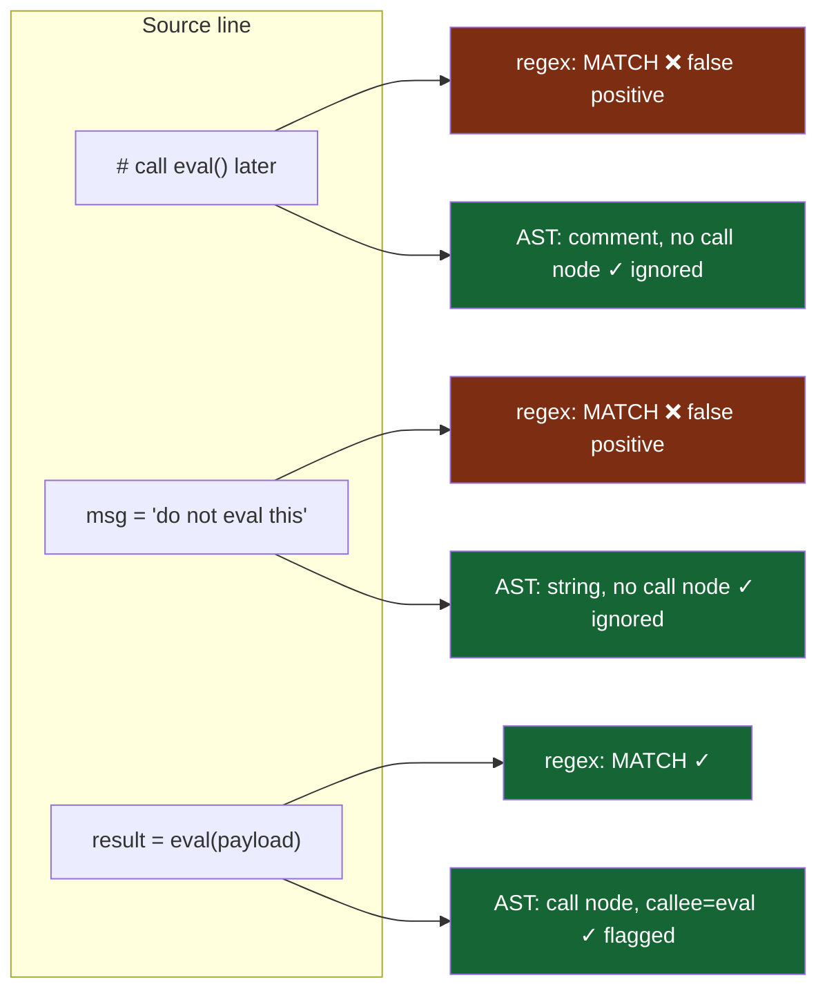
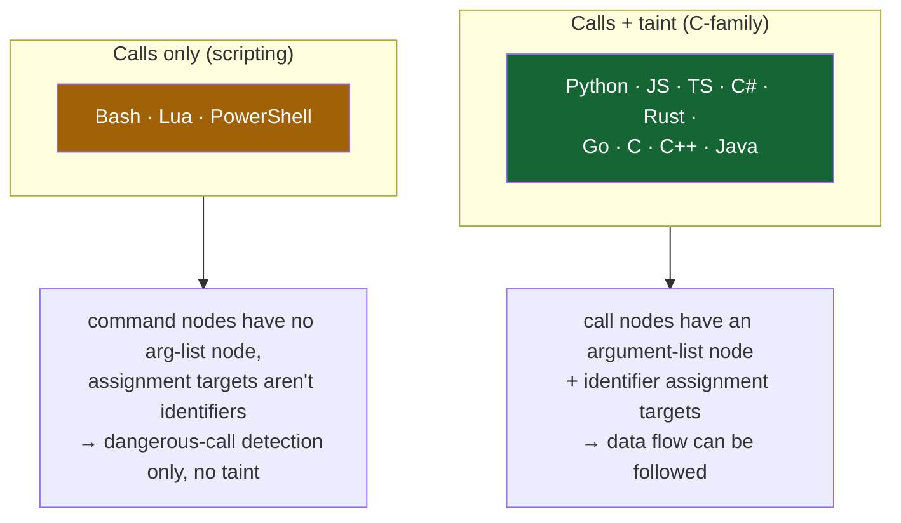
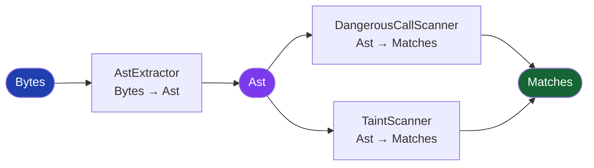
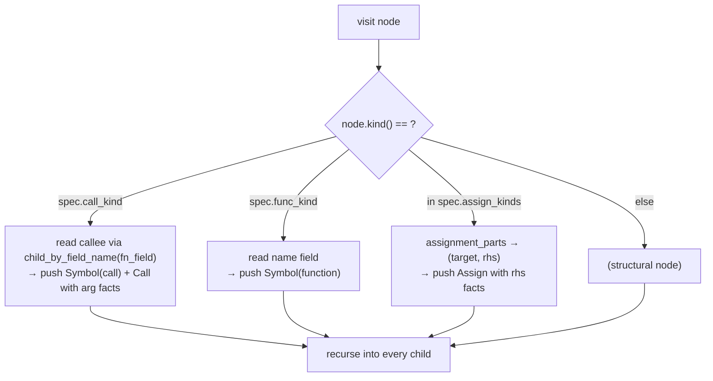
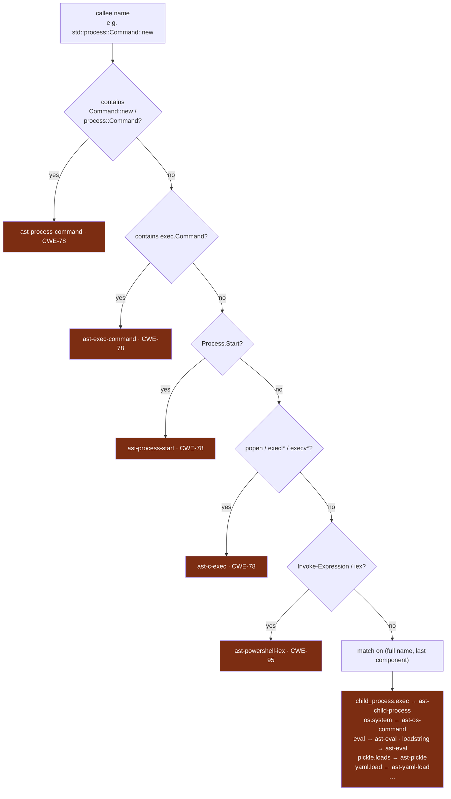
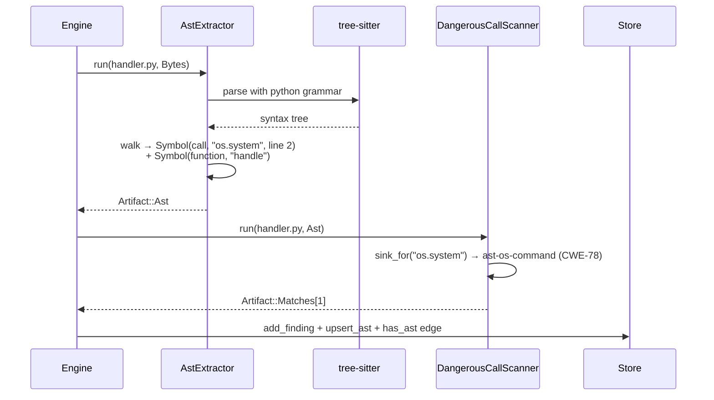

# 3 · The AST Scanner (`exfil-scan::ast`)

← [The engine](./engine.md) · Next: [Taint analysis →](./taint.md)

Most secret scanners are regexes over raw text. That is fast but blind: a regex
can't tell a real call to `eval(user_input)` from the word "eval" inside a comment
or a string literal. The **AST scanner** parses each source file into a real
syntax tree and reasons over *structure* instead of text — so it flags the call
and ignores the comment.

This page explains, from the ground up: what an AST is, how exfil parses 12
languages with one small table, how it detects dangerous calls, and every Rust
idiom involved.

Source: [`crates/exfil-scan/src/ast.rs`](../../crates/exfil-scan/src/ast.rs).

---

## 1. What is an AST, and why parse?

An **Abstract Syntax Tree** is the structured form of source code. Where text is a
flat string, an AST is a tree that knows "this is a function call, its callee is
`os.system`, its argument is the variable `req`."

Consider `os.system(req)`:



A regex sees the characters `o s . s y s t e m ( r e q )`. The AST sees a *call
node* whose *callee* is `os.system`. That difference is everything:



exfil's `comments_and_strings_are_not_flagged` test
([`ast.rs:663`](../../crates/exfil-scan/src/ast.rs#L663)) asserts exactly this:
`eval` in a comment and in a string produce **zero** findings.

---

## 2. The tool: tree-sitter

exfil parses with [tree-sitter](https://tree-sitter.github.io/), a parser
library with a grammar per language. Two properties make it ideal here:

- **Error-tolerant.** It parses incomplete or broken code into a best-effort tree
  rather than failing — important when scanning arbitrary files. Gibberish yields
  an empty result, never a crash
  ([`ast.rs:698`](../../crates/exfil-scan/src/ast.rs#L698)).
- **Uniform tree API.** Every language's tree is walked with the same `Node` API:
  `node.kind()`, `node.child_by_field_name(...)`, `node.children(...)`. This is
  what lets one piece of code handle 12 languages.

The grammars themselves are C code compiled at build time (via the `cc` crate);
everything exfil writes on top is pure, `unsafe`-free Rust.

> **A hard-won lesson baked into the code.** Each grammar is compiled for a
> specific tree-sitter *ABI*. The core was on tree-sitter 0.24, and the C#
> grammar (0.23) failed `set_language` at runtime — it compiled but wouldn't
> load, silently yielding empty ASTs. Bumping the core to 0.25 fixed C# *and*
> unlocked Bash/Lua/PowerShell. To make sure this never regresses silently, there
> is a test — `every_grammar_loads`
> ([`ast.rs`](../../crates/exfil-scan/src/ast.rs), in the `tests` module) — that
> parses one source per language and asserts the language tag survives. An ABI
> mismatch now fails the build instead of quietly finding nothing.

---

## 3. One table for twelve languages: `LangSpec`

The elegance of this module is that adding a language is (usually) **one struct
literal**. A `LangSpec` ([`ast.rs:45`](../../crates/exfil-scan/src/ast.rs#L45))
describes how one grammar names the things exfil cares about:

```rust
pub(crate) struct LangSpec {
    lang: &'static str,               // tag stored on the Ast, e.g. "python"
    extensions: &'static [&'static str], // file extensions selecting this language
    language: fn() -> tree_sitter::Language, // load the grammar
    call_kind: &'static str,          // node kind for a call, e.g. "call_expression"
    fn_field: &'static str,           // field holding the callee
    args_field: &'static str,         // field holding the argument list
    func_kind: &'static str,          // node kind for a function definition
    assign_kinds: &'static [&'static str], // node kinds for assignments
}
```

Why is this needed? Because grammars disagree on names. A function call is:

| Language | call node kind | callee field |
|----------|----------------|--------------|
| Python | `call` | `function` |
| JavaScript / TypeScript / Rust / Go / C / C++ | `call_expression` | `function` |
| Java | `method_invocation` | **`name`** |
| C# | `invocation_expression` | `function` |
| Bash / PowerShell | `command` | `name` / `command_name` |
| Lua | `function_call` | `name` |

The C-family share defaults (`DEFAULT_FN_FIELD = "function"`,
`DEFAULT_ARGS_FIELD = "arguments"`,
[`ast.rs:68`](../../crates/exfil-scan/src/ast.rs#L68)); the exceptions just set
their own fields. Here are two real entries
([`ast.rs:73`](../../crates/exfil-scan/src/ast.rs#L73)):

```rust
LangSpec {                              // Python
    lang: "python",
    extensions: &["py", "pyi"],
    language: || tree_sitter_python::LANGUAGE.into(),
    call_kind: "call",
    fn_field: DEFAULT_FN_FIELD,
    args_field: DEFAULT_ARGS_FIELD,
    func_kind: "function_definition",
    assign_kinds: &["assignment"],
},
LangSpec {                              // Java — note fn_field is "name"
    lang: "java",
    extensions: &["java"],
    language: || tree_sitter_java::LANGUAGE.into(),
    call_kind: "method_invocation",
    fn_field: "name",
    args_field: "arguments",
    func_kind: "method_declaration",
    assign_kinds: &["assignment_expression", "variable_declarator"],
},
```

`spec_for(path)` ([`ast.rs:209`](../../crates/exfil-scan/src/ast.rs#L209)) picks
the spec by file extension, and that's the whole language-selection logic.

> **Rust idiom — `&'static` and static promotion.** `specs()` returns
> `&'static [LangSpec]` — a slice that lives for the entire program. The `language`
> field is `fn() -> Language`, a *function pointer*; the `|| ....into()` closures
> capture nothing, so they coerce to plain function pointers and the whole array
> can be promoted to a `static`. (An earlier version used a `const fn` helper to
> build entries and it broke this promotion — the entries must be plain struct
> literals. That scar is why the table is spelled out longhand.)

### The two tiers of support

Not every language gets full analysis, and the reason is structural:



Bash and PowerShell `command` nodes carry no argument-list node, and their
assignment targets are `variable_name`/`variable` nodes rather than identifiers.
So they get dangerous-call detection *by callee name* (`eval`,
`Invoke-Expression`, `os.execute`) but **no taint propagation** — their
`assign_kinds` are deliberately empty ([`ast.rs`](../../crates/exfil-scan/src/ast.rs),
the bash/lua/powershell entries). This is a conscious false-negative: better
silent than noisy. (VB/VBScript are unsupported — no maintained grammar exists.)

---

## 4. The two tasks: extract, then scan

Recall from the [plugin DAG](./pipeline.md) that the AST work is *two* plugins,
not one:



- `AstExtractor` ([`ast.rs:236`](../../crates/exfil-scan/src/ast.rs#L236)) parses
  bytes into an `Ast` **once**.
- `DangerousCallScanner` ([`ast.rs`](../../crates/exfil-scan/src/ast.rs)) flags
  calls to dangerous sinks.
- `TaintScanner` (the [next page](./taint.md)) follows untrusted input into those
  sinks — *reusing the same parsed AST*, no re-parse.

That reuse is why extraction and scanning are separate: parse once, analyze twice
(or more, as scanners are added).

---

## 5. Extraction: walking the tree

`parse()` ([`ast.rs:218`](../../crates/exfil-scan/src/ast.rs#L218)) sets the
grammar, parses, and depth-first walks the tree, collecting three kinds of fact
into an `Ast` (the type is defined in `exfil-task`,
[`task/src/lib.rs:76`](../../crates/exfil-task/src/lib.rs#L76)):

- **symbols** — every call site and function definition (`Symbol { kind, name, line }`).
- **calls** — call sites with argument facts, for taint (`Call`).
- **assigns** — assignments with right-hand-side facts, for taint (`Assign`).

The heart is `walk()` ([`ast.rs:333`](../../crates/exfil-scan/src/ast.rs#L333)).
For each node it asks: is this a call, a function, or an assignment?



The callee is the **full dotted text**: `os.system`, `child_process.exec`,
`std::process::Command::new`. That matters downstream — the sink matcher needs the
whole name to tell `child_process.exec` from a bare `exec`
([`ast.rs:335-337`](../../crates/exfil-scan/src/ast.rs#L264)).

### Two helpers that absorb grammar quirks

Real grammars have irregularities. Two small helpers keep the walk uniform:

**`first_identifier`** ([`ast.rs:317`](../../crates/exfil-scan/src/ast.rs#L317)) —
some assignment targets aren't a bare identifier but *wrap* one. Go's
`c := r.FormValue(...)` has an `expression_list` target; a Rust `let` has a
pattern. This helper returns the node's text if it *is* an identifier, else
recurses to find the first identifier inside — so a wrapped target still yields a
variable name.

**`assignment_parts`** ([`ast.rs:241`](../../crates/exfil-scan/src/ast.rs#L241)) —
splits an assignment into `(target, rhs)`, trying field names in order: `left` /
`name` / `pattern` for the target, `right` / `value` for the RHS. It ends with a
**positional fallback** for C#, whose `var x = expr` declarator holds the
initializer as an *unnamed* child (no `value` field), so it takes the last named
child that isn't the target:

```rust
let rhs = node.child_by_field_name("right")
    .or_else(|| node.child_by_field_name("value"))
    .or_else(|| {                      // C#: initializer is an unnamed child
        let mut cursor = node.walk();
        node.named_children(&mut cursor)
            .filter(|n| n.id() != target.id())
            .last()
    })?;
```

That fallback is why C# taint works — `csharp_taint_from_console_readline`
([`ast.rs`](../../crates/exfil-scan/src/ast.rs), tests module) exercises exactly
`var c = Console.ReadLine(); Process.Start(c);`.

> **Rust idiom — `Option` combinators.** `child_by_field_name` returns
> `Option<Node>`. `.or_else(|| ...)` tries the next source only if the previous
> was `None`; the trailing `?` bails out of the function if *all* fail. This is
> null-handling without nulls. See the
> [primer](./rust-primer.md#option-and-the-question-mark).

---

## 6. Detection: `sink_for`

With the tree walked, `DangerousCallScanner` iterates the call symbols and asks
`sink_for(name)` ([`ast.rs:441`](../../crates/exfil-scan/src/ast.rs#L441)):
*is this callee a dangerous sink, and if so, how do I classify it?*



The design uses **cross-language prefix checks first, then a `match`** on the full
name and its last component. This ordering matters:

- Full-name checks come first so `child_process.exec` is a child-process sink, not
  a bare `exec` ([`ast.rs:516`](../../crates/exfil-scan/src/ast.rs#L516)).
- The last-component fallback lets both `system` and `os.system` resolve
  ([`ast.rs:441`](../../crates/exfil-scan/src/ast.rs#L441)).

Each sink carries a rule name, `Severity`, CWE, and a human "what" string
([`ast.rs:432`](../../crates/exfil-scan/src/ast.rs#L432)), which become the
finding's fields.

A representative slice of what's detected across languages:

| Callee (any language) | Rule | CWE | Why |
|-----------------------|------|-----|-----|
| `eval(...)`, Lua `loadstring` | `ast-eval` | CWE-95 | Code evaluation |
| `os.system`, C `system` | `ast-os-command` | CWE-78 | Shell command execution |
| `child_process.exec` (JS/TS) | `ast-child-process` | CWE-78 | Child-process shell |
| `std::process::Command::new` (Rust) | `ast-process-command` | CWE-78 | Process execution |
| `exec.Command` (Go) | `ast-exec-command` | CWE-78 | os/exec command |
| `Process.Start` (C#) | `ast-process-start` | CWE-78 | Process start |
| `popen` / `execl*` / `execv*` (C/C++, Lua `io.popen`) | `ast-c-exec` | CWE-78 | popen/exec family |
| `Invoke-Expression` / `iex` (PowerShell) | `ast-powershell-iex` | CWE-95 | Expression evaluation |
| `os.execute` (Lua) | `ast-lua-os-execute` | CWE-78 | Lua shell execution |
| `Runtime.getRuntime().exec` (Java) | `ast-exec` | CWE-95 | Dynamic execution |
| `pickle.loads` (Python) | `ast-pickle` | CWE-502 | Unsafe deserialization |
| `yaml.load` (Python) | `ast-yaml-load` | CWE-502 | yaml.load without SafeLoader |

Every row above has a language-specific test in the module
([`ast.rs:770`](../../crates/exfil-scan/src/ast.rs#L770) onward): Go
`exec.Command`, Rust `Command::new`, Java `Runtime.exec`, C `system`/`popen`, TS
`child_process`, Bash `eval`, Lua `os.execute`/`loadstring`, PowerShell
`Invoke-Expression`, C# `Process.Start`.

---

## 7. End to end: one Python file

Tying the whole page together with `os.system(req)` inside a handler:



The engine's `ast_scanner_flags_dangerous_calls_and_stores_ast` test
([`engine/src/lib.rs:799`](../../crates/exfil-engine/src/lib.rs#L799)) drives
exactly this and additionally asserts the AST was persisted and linked to the file
with a `has_ast` edge you can then navigate in the [TUI](./cli-tui.md).

---

## 8. Adding a 13th language

To appreciate how contained this is, here's the full recipe:

1. Add the grammar crate to
   [`exfil-scan/Cargo.toml`](../../crates/exfil-scan/Cargo.toml).
2. Add one `LangSpec` entry to `specs()` — extensions, grammar loader, and the
   node-kind/field names its calls/functions/assignments use. (Discover those by
   printing `tree.root_node().to_sexp()` on a sample — that's literally how
   Bash/Lua/PowerShell were mapped.)
3. If it has language-specific sinks, add them to `sink_for`.
4. Add it to the `[plugins.ast].languages` list in
   [`config.toml`](../../crates/exfil-config/config.toml).
5. Write a test; `every_grammar_loads` covers the ABI check for free.

No change to the walk, the engine, or the store. That is the payoff of the
`LangSpec` table.

---

**Next:** [Taint analysis](./taint.md) takes these same parsed ASTs and answers a
sharper question — not "is there a dangerous call?" but "does *attacker-controlled
data* actually reach it?"
