# 2 · The Engine (`exfill-engine`)

← [The plugin DAG](./pipeline.md) · Next: [The AST scanner →](./ast.md)

The engine is the heart of exfill. Everything else is a plugin or a data type;
the engine is the thing that **puts them in motion**: it walks the filesystem on
many threads, reads and hashes each file once, drives the [plugin DAG](./pipeline.md)
over its bytes, and streams the results into the [graph store](./store.md).

This page is deliberately diagram-heavy. Read the diagrams first, then the prose.

Source:
[`crates/exfill-engine/src/lib.rs`](../../crates/exfill-engine/src/lib.rs) (the
scan machinery) and
[`crates/exfill-engine/src/run.rs`](../../crates/exfill-engine/src/run.rs) (the
coarse fetch → scan → report stages).

---

## 1. Two levels of orchestration

The engine orchestrates at **two altitudes**, and it helps to keep them separate
in your head:

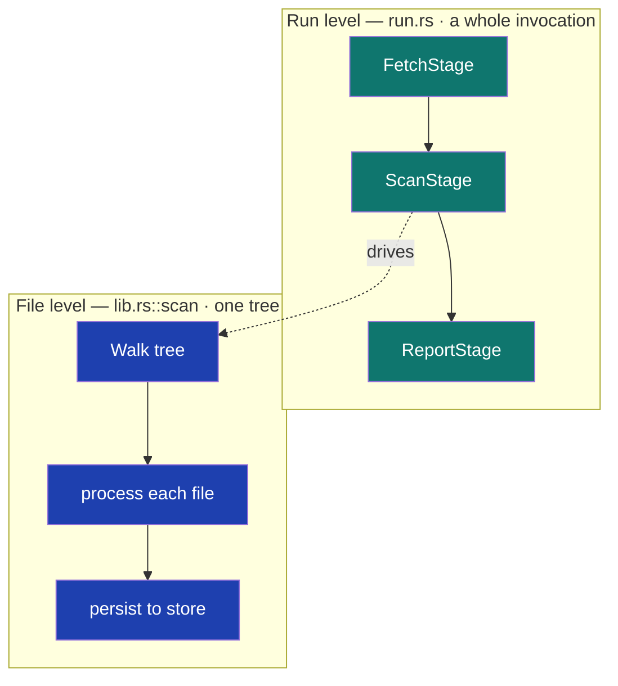

- **Run level** (`run.rs`): a run is a sequence of `RunStage`s —
  **fetch → scan → report**. Stages never call each other; they coordinate only
  through the shared graph. This is "plugins communicate through a graph
  interface."
- **File level** (`lib.rs::scan`): the `ScanStage` calls `scan()`, which does the
  real work — the parallel walk, hashing, pipeline, and persistence.

We cover the run level briefly, then spend most of the page on the file level.

---

## 2. Run level: fetch → scan → report

A `RunStage` ([`run.rs:41`](../../crates/exfill-engine/src/run.rs#L41)) is one
phase of a run:

```rust
#[async_trait]
pub trait RunStage: Send + Sync {
    fn name(&self) -> &str;
    async fn run(&self, ctx: &RunCtx) -> Result<()>;
}
```

`run_stages` ([`run.rs:52`](../../crates/exfill-engine/src/run.rs#L52)) executes
them in order and stops at the first error, tagging it with the stage name:

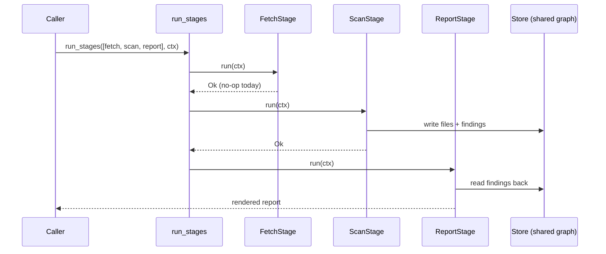

The three stages:

| Stage | File:line | Does |
|-------|-----------|------|
| `FetchStage` | [`run.rs:67`](../../crates/exfill-engine/src/run.rs#L67) | Refresh datasets/rules. A **declared no-op today** — the shape is in place for when sources land, so nothing else has to be reshaped later. |
| `ScanStage` | [`run.rs:84`](../../crates/exfill-engine/src/run.rs#L84) | Calls `scan(root, pipeline, store, skip_dir, events)`. |
| `ReportStage` | [`run.rs:114`](../../crates/exfill-engine/src/run.rs#L114) | Reads findings via `gather_analysis`, picks a `reporter_for(format)`, renders into a shared sink. |

They share `RunCtx` ([`run.rs:32`](../../crates/exfill-engine/src/run.rs#L32)),
which holds an `Arc<Store>` (a cheap-to-clone, thread-safe graph handle) and an
optional progress-event sender. The scan stage *writes* findings to the graph;
the report stage *reads them back*. That indirection — never a direct call
between stages — is what lets you add or reorder stages freely.

> **Rust idiom — `#[async_trait]`.** A plain `async fn` inside a trait can't yet
> be used behind `dyn` (object safety). The `#[async_trait]` macro rewrites each
> `async fn` to return a boxed future, which *is* object-safe, so
> `Box<dyn RunStage>` works ([`run.rs:10-15`](../../crates/exfill-engine/src/run.rs#L10)).
> See the [primer](./rust-primer.md#async-traits).

---

## 3. File level: the anatomy of `scan()`

`scan()` ([`lib.rs:139`](../../crates/exfill-engine/src/lib.rs#L139)) is the big
one. Its signature:

```rust
pub async fn scan(
    root: &Path,
    pipeline: &Pipeline,
    store: &Store,
    skip_dir: Option<&Path>,
    events: Option<mpsc::Sender<ScanEvent>>,
) -> Result<Summary>
```

Here is the whole flow before we dissect it:

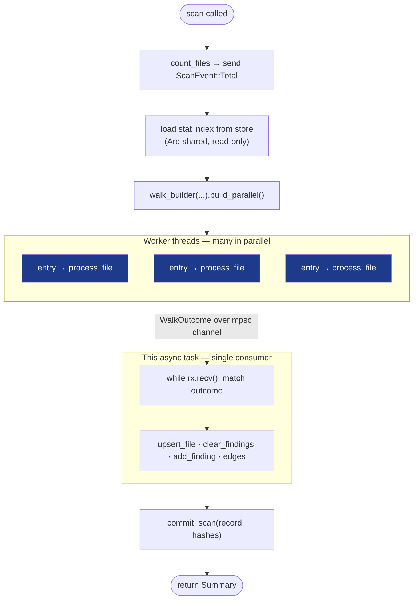

The five phases:

1. **Pre-count** ([`lib.rs:146`](../../crates/exfill-engine/src/lib.rs#L146)) — if
   a progress channel is attached, do a cheap stat-only walk to count files and
   send `ScanEvent::Total(n)` first, so a progress bar knows the denominator.
2. **Load the stat index** ([`lib.rs:152`](../../crates/exfill-engine/src/lib.rs#L152))
   — the incremental cache from the last scan, wrapped in `Arc` so every worker
   thread shares one read-only copy.
3. **Parallel walk** ([`lib.rs:164`](../../crates/exfill-engine/src/lib.rs#L164))
   — worker threads each `process_file` and send a `WalkOutcome` over a channel.
4. **Drain and persist** ([`lib.rs:211`](../../crates/exfill-engine/src/lib.rs#L211))
   — this async task reads outcomes off the channel and writes to the store.
5. **Commit** ([`lib.rs:245`](../../crates/exfill-engine/src/lib.rs#L245)) — write
   the `scan` record linking every file this scan saw.

---

## 4. The two-worlds concurrency model

This is the part most worth understanding, because it mixes **threads** and
**async** — two different concurrency models — on purpose.

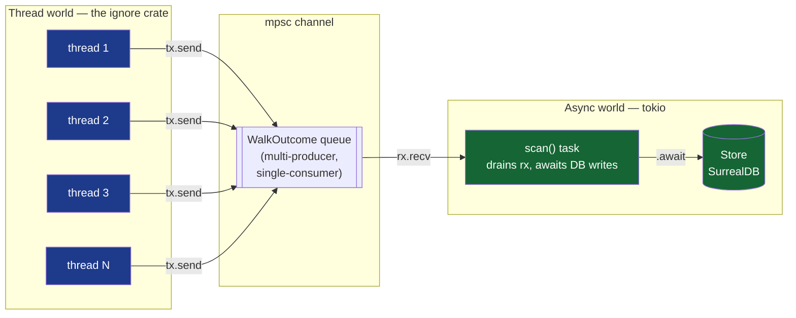

- **The walk is thread-based.** The [`ignore`](https://docs.rs/ignore) crate
  spins up OS threads that each visit directory entries and read/hash/scan files.
  CPU-bound file work belongs on threads.
- **The database is async.** SurrealDB writes are `.await`ed by the single
  `scan()` task after workers produce results. I/O-bound DB work belongs on the
  async runtime.
- **They meet at an `mpsc` channel** ([`lib.rs:161`](../../crates/exfill-engine/src/lib.rs#L161)):
  *multi-producer* (every worker gets a clone of the sender `tx`),
  *single-consumer* (only `scan()` reads `rx`).

There is an elegant detail in how the loop *ends*. There is no "I'm done" signal.
Each worker holds a clone of `tx`; the original is explicitly dropped with
`drop(tx)` ([`lib.rs:204`](../../crates/exfill-engine/src/lib.rs#L204)). When the
last worker finishes and its clone drops, the channel has no senders left, so
`rx.recv()` returns `Err` and the `while let Ok(res) = rx.recv()` drain loop
([`lib.rs:211`](../../crates/exfill-engine/src/lib.rs#L211)) naturally exits.

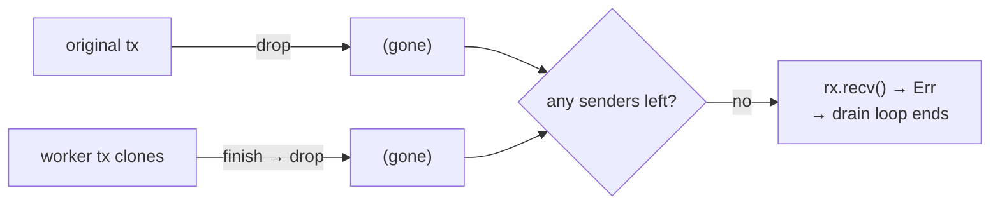

> **Rust idiom — `move` closures own their captures.** The per-thread closure is
> `Box::new(move |entry| ...)` ([`lib.rs:170`](../../crates/exfill-engine/src/lib.rs#L170)).
> `move` transfers ownership of the cloned `tx`/`host`/`index` into the closure,
> so each thread owns its handles outright — the compiler forbids one thread from
> borrowing another's locals. See the [primer](./rust-primer.md#move-closures).

---

## 5. Processing one file: `process_file`

Each worker calls `process_file`
([`lib.rs:379`](../../crates/exfill-engine/src/lib.rs#L379)). This is where the
**incremental fast-path** lives — the reason a rescan is fast.

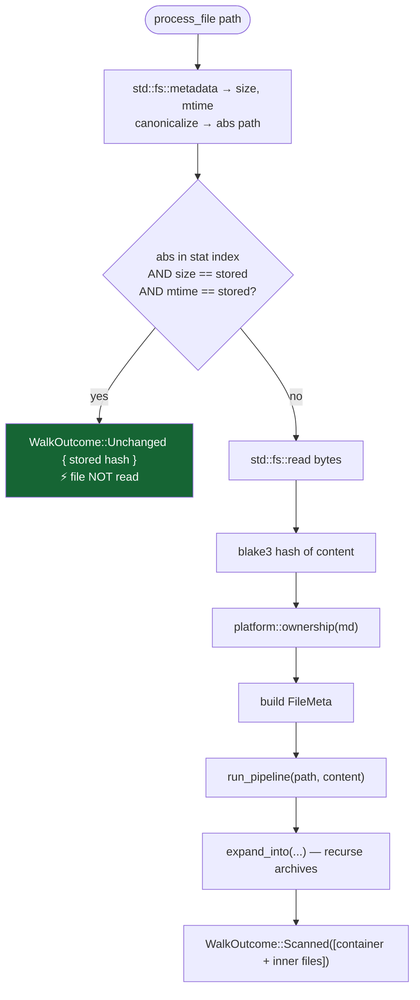

The fast-path condition ([`lib.rs:395`](../../crates/exfill-engine/src/lib.rs#L395)):

```rust
if let Some(prev) = index.get(&abs.display().to_string()) {
    if prev.size == md.len() && prev.mtime == mtime && !mtime.is_empty() {
        return Ok(WalkOutcome::Unchanged { hash: prev.hash.clone() });
    }
}
```

The incremental key is **canonical path → (size, mtime-in-seconds, stored hash)**.
If size and mtime both match the last scan, the file is assumed unchanged: it is
**not read, not hashed, not scanned** — its stored records and findings are reused
as-is, and the stored hash keeps it in this scan's file list. This is what makes
rescanning a large tree cheap: only changed files pay the read/hash/scan cost.

The three possible outcomes of a file are the `WalkOutcome` enum
([`lib.rs:77`](../../crates/exfill-engine/src/lib.rs#L77)):

| Outcome | Meaning | Effect on `Summary` |
|---------|---------|---------------------|
| `Scanned(Vec<FileResult>)` | Read, hashed, scanned — the container plus any expanded inner files | `files += n`, `matches += hits` |
| `Unchanged { hash }` | Fast-path hit — reused unread | `files += 1`, `unchanged += 1` |
| `Error` | Could not stat/read (permissions, race) — skipped, not fatal | `errors += 1` |

That last row matters operationally: an unreadable file (permission denied,
deleted mid-scan) **counts but never aborts the scan**
([`lib.rs:184-187`](../../crates/exfill-engine/src/lib.rs#L184)). There is a Unix
test that sets a file to `0o000` and asserts the scan still completes with
`errors == 1` ([`lib.rs:614`](../../crates/exfill-engine/src/lib.rs#L614)).

---

## 6. What actually gets scanned: `run_pipeline`

`run_pipeline` ([`lib.rs:445`](../../crates/exfill-engine/src/lib.rs#L445)) decides
*how* a file's bytes are handled before handing them to the [plugin DAG](./pipeline.md):

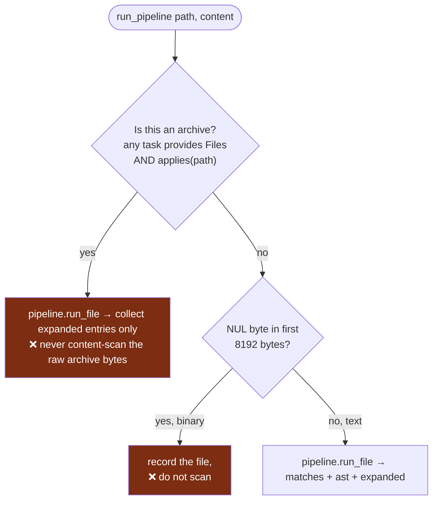

Two guards, each preventing garbage findings:

- **Archives are containers, not content** ([`lib.rs:449-462`](../../crates/exfill-engine/src/lib.rs#L449)).
  A `.zip`'s raw compressed bytes would match rules by coincidence (compression
  looks random). So an archive is *expanded* but never content-scanned; only its
  inner files are scanned, individually, after expansion.
- **Binary files are recorded but not scanned** ([`lib.rs:464-468`](../../crates/exfill-engine/src/lib.rs#L464)).
  A NUL byte in the first 8 KB (`BINARY_SNIFF_LEN`) marks a file as binary. It
  still gets a file record (full filesystem coverage) but text scanners would
  produce noise on it, so they are skipped. (Hash-based scanners like IOC/ClamAV
  would still apply on non-binary paths; the point is the *text* scanners.)

---

## 7. Archives: recursive expansion {#archives}

When `run_pipeline` expands an archive, `expand_into`
([`lib.rs:481`](../../crates/exfill-engine/src/lib.rs#L481)) turns each entry into
its own `FileResult`, scans it, and **recurses into nested archives** — a zip
inside a tar inside a zip:

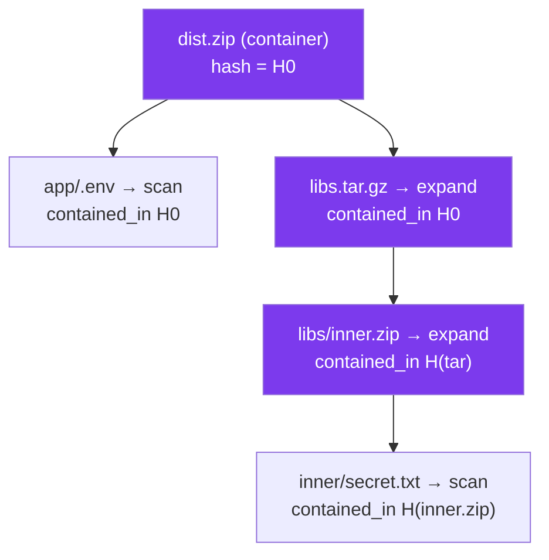

Key facts:

- Each entry is a `VirtualFile` with a `!`-joined path like `dist.zip!app/.env`
  — it never touches disk; it lives in memory. (This is also the mitigation for
  *zip-slip*: entry names like `../../etc/passwd` become display paths, never
  filesystem writes. See [scanners](./scanners.md#archive-safety).)
- Every expanded file records a `contained_in` edge to its container's hash
  ([`lib.rs:513`](../../crates/exfill-engine/src/lib.rs#L513)), so the graph knows
  which archive a finding came from.
- Recursion stops at `MAX_EXPAND_DEPTH = 8`
  ([`lib.rs:47`](../../crates/exfill-engine/src/lib.rs#L47), checked at
  [`lib.rs:489`](../../crates/exfill-engine/src/lib.rs#L489)) — a bound against
  hostile zip-in-zip-in-zip "bombs."

There is a test that zips a secret with no copy on disk, scans, and asserts both
the archive and its inner file are recorded and linked
([`lib.rs:858`](../../crates/exfill-engine/src/lib.rs#L858)).

---

## 8. Persistence: replace, don't append

Back in the drain loop, for each scanned file the engine writes
([`lib.rs:213-234`](../../crates/exfill-engine/src/lib.rs#L213)):

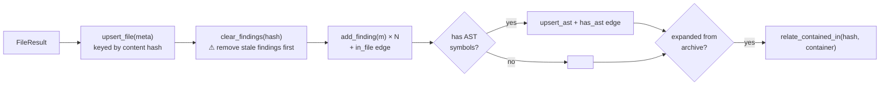

The critical line is `clear_findings` **before** `add_finding`
([`lib.rs:220`](../../crates/exfill-engine/src/lib.rs#L220)): findings are
**replaced, not appended**. Rescanning the same content removes the previous
scan's findings for that file hash before inserting fresh ones — so a rescan can
never *duplicate* findings. The engine's integration test rescans a tree three
times and asserts the finding count stays correct
([`lib.rs:524`](../../crates/exfill-engine/src/lib.rs#L524)).

Because files are **content-addressed** (the record id *is* the blake3 hash),
editing a file produces a *new* record at the new hash; the old content's record
lingers, orphaned, until [garbage collection](./store.md#gc) prunes it.

Finally, `commit_scan` ([`lib.rs:245`](../../crates/exfill-engine/src/lib.rs#L245))
writes a `scan` record with an `includes` edge to every file hash this scan saw —
whether freshly scanned or reused via the fast-path. That is what ties a scan
together and lets `gc` later keep "the latest scan and everything it reaches."

---

## 9. Live progress: the `ScanEvent` channel

The engine **never prints**. It reports through an optional channel of
`ScanEvent`s ([`lib.rs:92`](../../crates/exfill-engine/src/lib.rs#L92)) and lets
the caller decide how to render — a plain line printer, a
[ratatui gauge](./cli-tui.md#progress), or nothing at all:

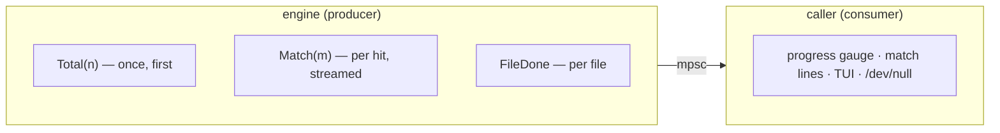

`Total` is sent once up front; `Match` streams as each hit is found (so you see
secrets appear live, mid-scan); `FileDone` ticks once per completed file. Passing
`None` for the channel skips reporting entirely — that is how the non-interactive
and test paths run silently.

---

## 10. Remote scans: `scan_remote`

Scanning another host over SSH reuses *everything* above except the walk. The
engine defines a `RemoteFs` trait ([`lib.rs:264`](../../crates/exfill-engine/src/lib.rs#L264)):

```rust
#[async_trait]
pub trait RemoteFs: Send + Sync {
    fn host(&self) -> &str;
    async fn list(&self, root: &str) -> Result<Vec<String>>;
    async fn read(&self, path: &str) -> Result<Vec<u8>>;
}
```

`scan_remote` ([`lib.rs:280`](../../crates/exfill-engine/src/lib.rs#L280)) lists
files, reads each one's bytes, and runs the **exact same** `run_pipeline` +
`expand_into` + persistence. The scanners never know the bytes came over a
network:

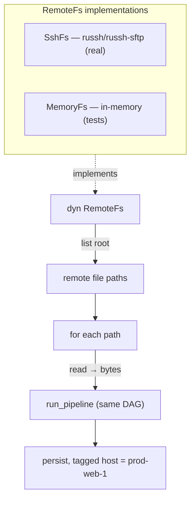

Differences from a local scan, by design:

- **Serial, not parallel** — one host, read over one SSH session.
- **No incremental fast-path** — every remote file is read (no local stat cache
  to trust).
- **Files are tagged with the remote host** (`abs = "{host}:{path}"`), so findings
  say where they came from.

The real implementation is [`SshFs`](./integrations.md#remote) in `exfill-remote`
(pure-Rust `russh`, no C libssh). Tests use an in-memory `MemoryFs`
([`lib.rs:648`](../../crates/exfill-engine/src/lib.rs#L648)) so remote logic is
verified without a network — the trait is the seam that makes that possible.

---

## 11. The `Summary` you get back

Every scan returns a `Summary` ([`lib.rs:50`](../../crates/exfill-engine/src/lib.rs#L50)):

| Field | Meaning |
|-------|---------|
| `files` | All regular files recorded (including unchanged ones) |
| `matches` | Matches in files *(re)scanned this run* — findings on unchanged files are already stored and not re-counted |
| `unchanged` | Files skipped via the stat fast-path |
| `errors` | Files that could not be read |

That `matches`-only-counts-rescanned-files nuance is exactly what the incremental
design implies: on a no-change rescan you get `unchanged == files` and
`matches == 0`, because nothing was re-read — yet the findings are all still in
the store from before.

---

## 12. Putting it all together

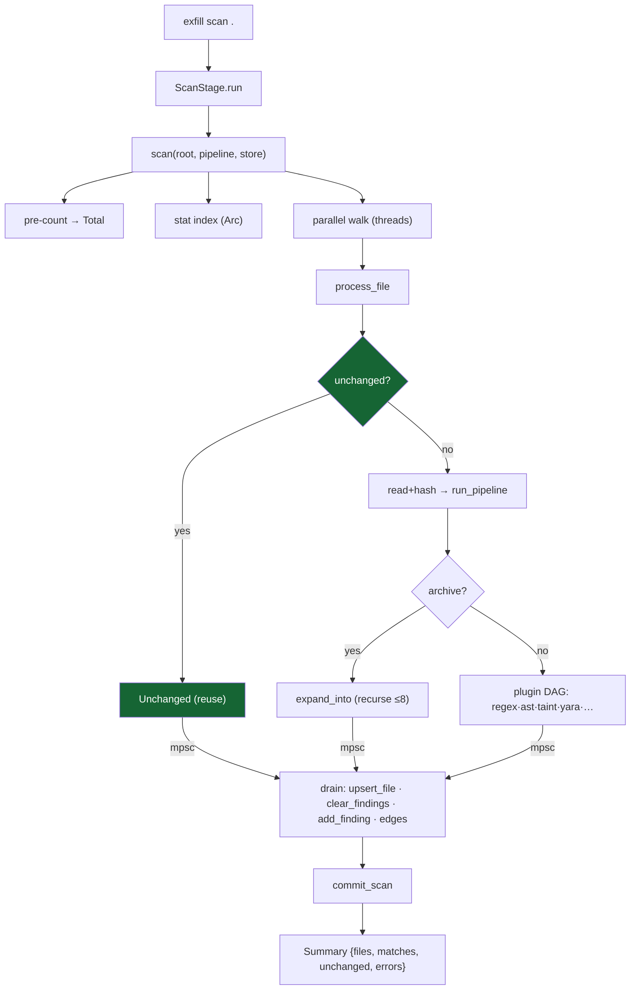

**Where to go next:**

- The `run_pipeline → DAG` box is the [plugin DAG](./pipeline.md) (previous page).
- The `ast` node inside the DAG is the [AST scanner](./ast.md) — the next page,
  and the other component you asked about in depth.
- The `upsert_file / edges / commit_scan` writes are the
  [graph store](./store.md).
- The progress channel feeds the [CLI/TUI progress bar](./cli-tui.md#progress).
