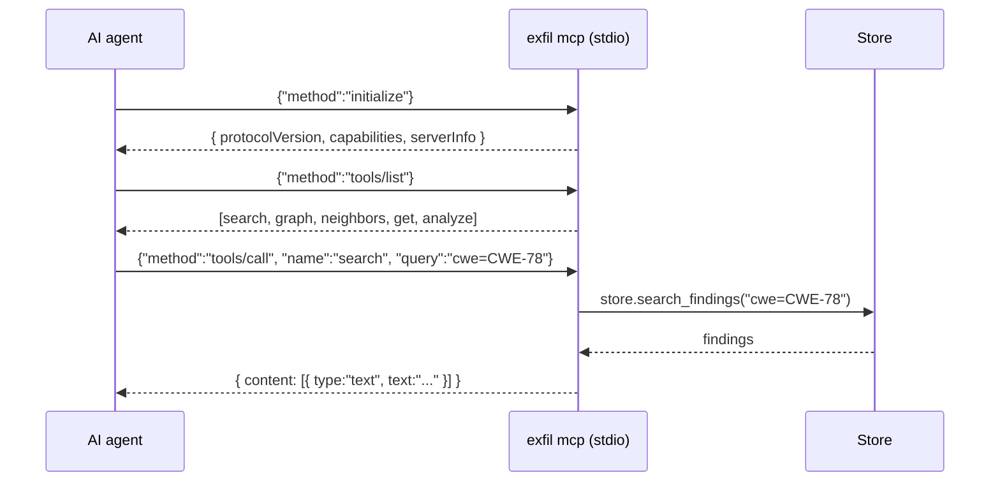
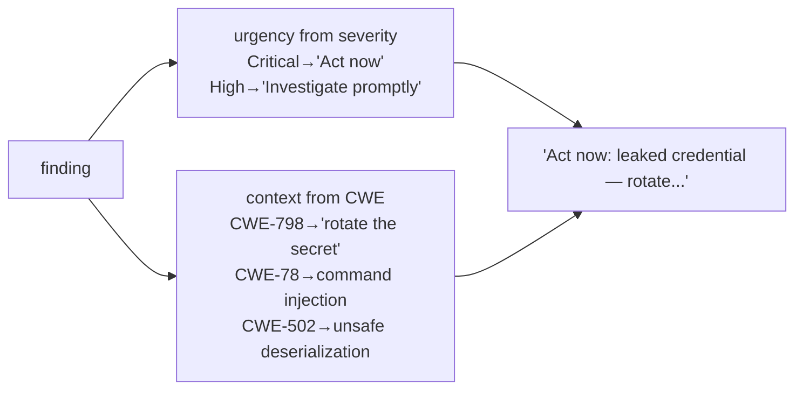
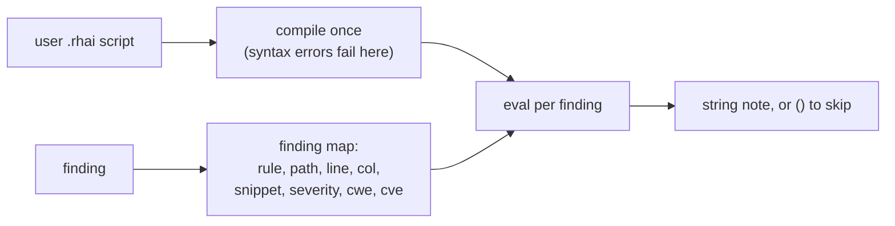
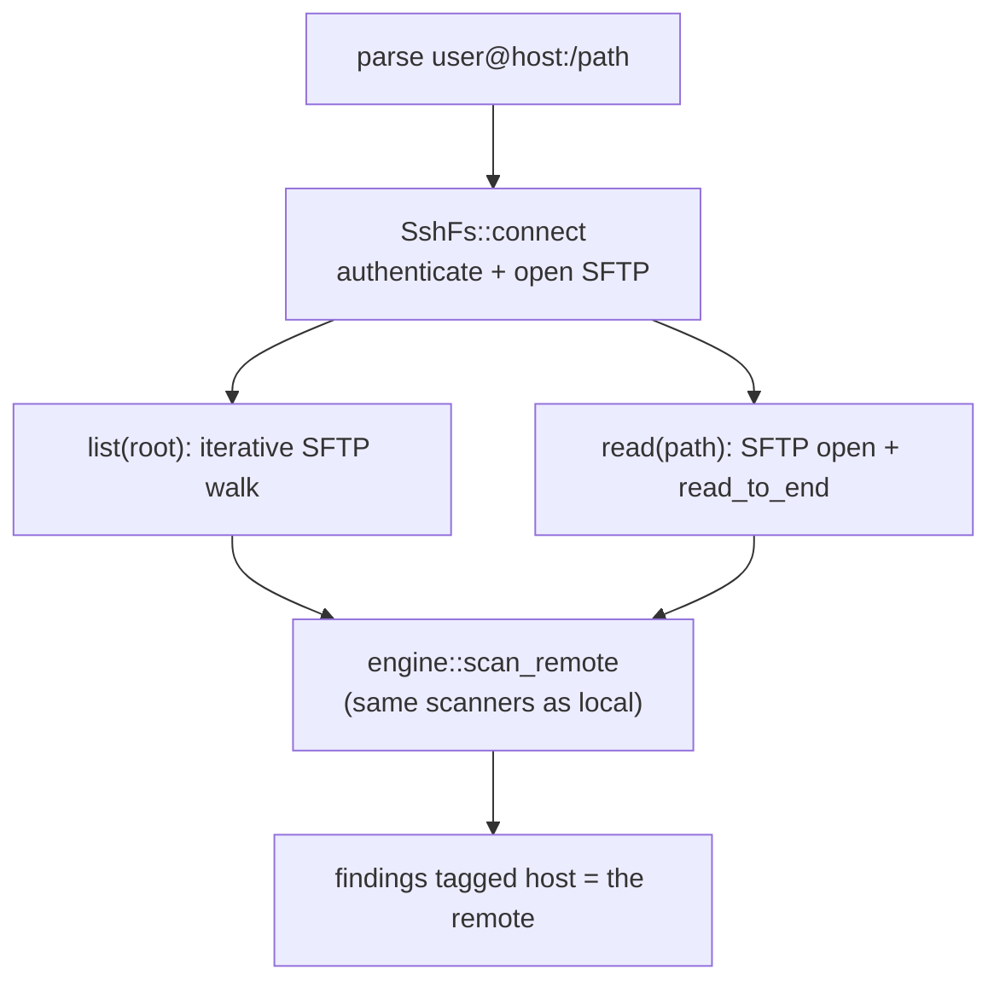
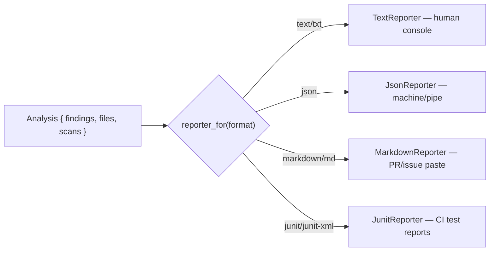
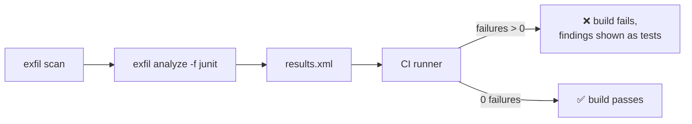
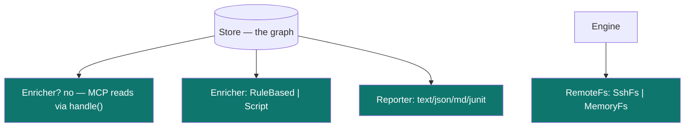

# 8 · Integrations (`mcp` · `llm` · `script` · `remote` · `report`)

← [CLI, TUI & navigator](./cli-tui.md) · Next: [Rust primer →](./rust-primer.md)

The final layer is how exfil talks to the outside world: an **MCP server** for AI
agents, **offline enrichment** (rule-based and Rhai-scripted), **remote scanning**
over SSH, and **reporters** that render findings for humans and CI. Each is a small
crate behind a trait.

---

## 1. MCP server — findings for AI agents (`exfil-mcp`)

[MCP](https://modelcontextprotocol.io/) (Model Context Protocol) is the standard by
which AI agents call tools. `exfil mcp` runs a JSON-RPC 2.0 server over stdio that
exposes the findings graph, so an agent (like Claude) can query your scan results
directly.

Source: [`crates/exfil-mcp/src/lib.rs`](../../crates/exfil-mcp/src/lib.rs).



The design splits the *logic* from the *I/O* so it's testable:

- `handle(store, req)` ([`mcp/lib.rs:62`](../../crates/exfil-mcp/src/lib.rs#L62))
  is a pure function: one JSON request in, one JSON response out (or `None` for a
  notification — a request with no `id`, dropped via the `?`-on-`Option` idiom).
- `serve(store)` ([`mcp/lib.rs:162`](../../crates/exfil-mcp/src/lib.rs#L162)) is
  the thin stdio loop: read a line, parse JSON, call `handle`, write the response.

**The five tools** ([`mcp/lib.rs:28`](../../crates/exfil-mcp/src/lib.rs#L28)) — all
read-only queries over the store:

| Tool | Argument | Returns |
|------|----------|---------|
| `search` | `query` (filter or free text) | Findings as `path:line:col [rule] snippet` lines |
| `graph` | `query` (optional filter) | The findings graph as JSON (nodes + edges) |
| `neighbors` | `id` (e.g. `file:<hash>`) | Connected nodes as JSON |
| `get` | `id` (e.g. `finding:...`) | One record as JSON |
| `analyze` | `query` (optional filter) | A text analysis report (counts, risk score) |

Note the two error layers: an *unknown tool* is a JSON-RPC error (protocol-level),
but a *tool that ran and failed* returns `isError: true` MCP content
([`mcp/lib.rs:115`](../../crates/exfil-mcp/src/lib.rs#L115)) — visible to the agent
as a result, not a transport failure. That distinction is what lets an agent see
"your query was malformed" without the connection dying.

---

## 2. Enrichment — triage notes (`exfil-llm`)

Enrichment writes a short **triage note** onto each finding — "Act now: leaked
credential — rotate the secret." The `Enricher` trait
([`llm/lib.rs:18`](../../crates/exfil-llm/src/lib.rs#L18)) is the seam; today's
implementation is rule-based, but the trait is deliberately shaped so an offline
LLM can drop in later without changing anything else.

```rust
pub trait Enricher: Send + Sync {
    fn name(&self) -> &str;
    fn available(&self) -> bool;                    // is a model loaded?
    fn triage(&self, finding: &Match) -> Option<String>;  // the note, or None
}
```

`RuleBasedEnricher` ([`llm/lib.rs:31`](../../crates/exfil-llm/src/lib.rs#L31))
composes `"{urgency}: {context}."` from severity and CWE:



`run(store, enricher)` ([`llm/lib.rs:73`](../../crates/exfil-llm/src/lib.rs#L73))
is the pass: if the enricher isn't available it's a no-op; otherwise it reads every
finding, calls `triage`, and writes the note to the finding's `triage` field via
`set_field`. It returns how many findings it enriched.

> **Why a trait and not a hardcoded function?** The whole point is the seam. A real
> [Candle](https://github.com/huggingface/candle)-based local model is a heavy
> dependency; keeping enrichment behind `Enricher` means that model can be added as
> one more implementation, and everything downstream (`enrich` command, storage)
> stays identical.

---

## 3. Rhai scripting — user triage rules (`exfil-script`)

For custom triage logic you don't want to recompile, `ScriptEnricher`
([`script/lib.rs:24`](../../crates/exfil-script/src/lib.rs#L24)) implements the
*same* `Enricher` trait using a [Rhai](https://rhai.rs) script — a pure-Rust,
sandboxed scripting language.



```rhai
if finding.severity == "critical" {
    "URGENT — " + finding.rule + " in " + finding.path
} else { () }
```

The safety story is the point:

- **Sandboxed** — Rhai scripts have no filesystem or network access, so running an
  untrusted rule set is safe ([`script/lib.rs:15`](../../crates/exfil-script/src/lib.rs#L15)).
- **Bounded** — `set_max_operations(500_000)` and `set_max_expr_depths(64, 64)`
  ([`script/lib.rs:36`](../../crates/exfil-script/src/lib.rs#L36)) cap a runaway or
  malicious script.
- **Fail-soft at runtime** — a script error (or a non-string result) yields *no
  note* rather than aborting the whole enrichment pass
  ([`script/lib.rs:89`](../../crates/exfil-script/src/lib.rs#L89)); syntax errors,
  by contrast, fail early at compile time.

---

## 4. Remote scanning over SSH (`exfil-remote`) {#remote}

`exfil scan-remote user@host:/path` scans another machine. `exfil-remote`
implements the engine's [`RemoteFs`](./engine.md#10-remote-scans-scan_remote) trait
over SSH/SFTP using pure-Rust [`russh`](https://docs.rs/russh) — no C `libssh2`.



- `RemoteTarget::parse` ([`remote/lib.rs:38`](../../crates/exfil-remote/src/lib.rs#L38))
  handles SCP-style `[user@]host[:/path]`, defaulting the user to `$USER` and the
  path to `/`.
- Auth is key (`-k`, with optional passphrase) or password
  (`$EXFIL_SSH_PASSWORD`) ([`remote/lib.rs:65`](../../crates/exfil-remote/src/lib.rs#L65)).
- The directory walk is **stack-based, not recursive**
  ([`remote/lib.rs:148`](../../crates/exfil-remote/src/lib.rs#L148)) — a `while let
  Some(dir) = stack.pop()` loop — so a deep remote tree can't blow the call stack.

Because it implements `RemoteFs`, the scanners "never know the bytes came from the
network" — the exact same [pipeline](./pipeline.md) runs. (Host-key verification is
a noted follow-up; today it accepts any host key.)

---

## 5. Reporting (`exfil-report`) {#reporting}

Reporters turn an `Analysis` (findings + store counts) into output. Each format is
a `Reporter` ([`report/lib.rs:72`](../../crates/exfil-report/src/lib.rs#L72));
`reporter_for(name)` ([`report/lib.rs:82`](../../crates/exfil-report/src/lib.rs#L82))
picks one.



| Format | Use | Notes |
|--------|-----|-------|
| `text` | Console reading | Findings + severity summary + risk score |
| `json` | Piping / tooling | `{ summary, findings }`; `Match`'s own serde shape is the wire format |
| `markdown` | Paste into a PR/issue | Severity + findings tables; pipes in snippets escaped |
| `junit` | **CI gating** | Each finding is a failing `<testcase>`; a clean scan is a passing suite |

The **JUnit** reporter ([`report/lib.rs`](../../crates/exfil-report/src/lib.rs),
`JunitReporter`) is built for CI: runners like Jenkins, GitLab CI, and GitHub
Actions ingest JUnit XML natively, so `exfil analyze -f junit > results.xml` lets a
pipeline **fail the build on findings** and show each one as a failed test. Every
XML metacharacter in rule names, messages, and snippets is escaped so a crafted
snippet can't break the document. Zero findings → `tests="0" failures="0"` → the
build goes green.



The trait writes to any `&mut dyn Write` — a file, stdout, or an in-memory buffer —
which is how every reporter is tested without touching the filesystem
([`report/lib.rs:8-11`](../../crates/exfil-report/src/lib.rs#L8)).

---

## 6. How it all connects

Every integration in this section is a **trait implementation** plugging into a
seam the rest of exfil already defined:



- `Enricher` (llm/script), `Reporter` (report), `RemoteFs` (remote), `Source`
  (source), `Viewer` (view) — all the same pattern: **define a trait, implement it,
  register it.**
- That is the through-line of the whole architecture. Once you've seen
  [`FileTask`](./pipeline.md), every other extension point reads the same way.

---

**Next:** the [Rust primer](./rust-primer.md) collects every Rust concept these
pages leaned on — traits, enums, `Option`/`Result`, `Box<dyn>`, `async`, `Arc`,
lifetimes — explained from scratch with the exact code that uses them.
