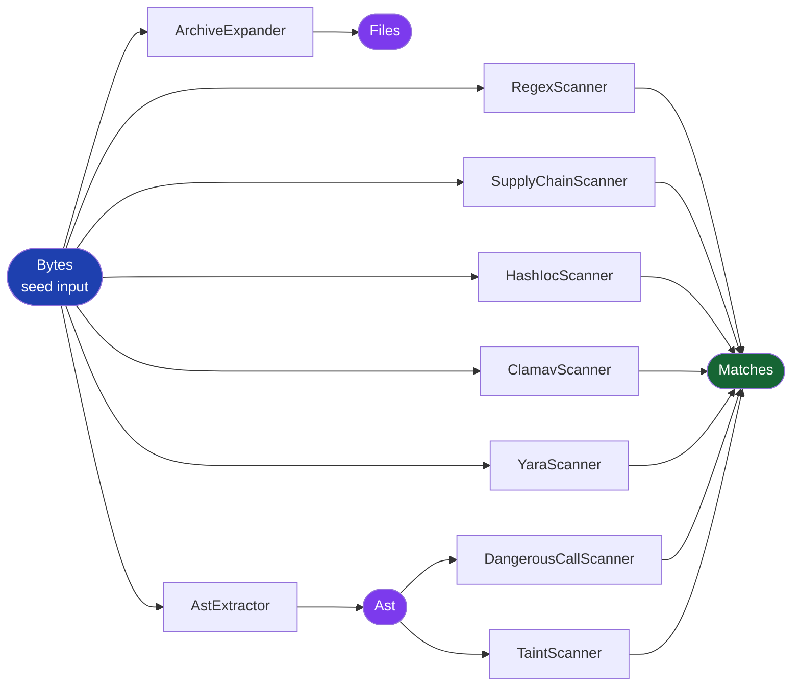
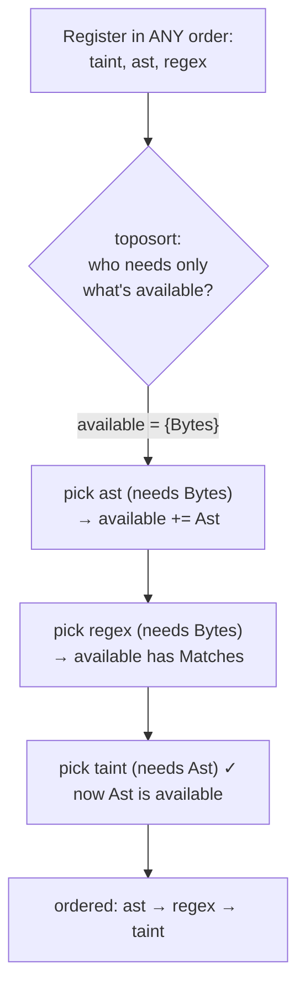

# 1 · The Plugin DAG (`exfil-task`)

← [Overview](./overview.md) · Next: [The engine →](./engine.md)

This is the single most important design idea in exfil. Once you understand it,
the engine, the scanners, and the AST analysis all fall into place — because they
are all just *plugins on this one mechanism*.

Source: [`crates/exfil-task/src/lib.rs`](../../crates/exfil-task/src/lib.rs)
(442 lines, no external dependencies beyond `exfil-core` and serde).

---

## 1. The problem it solves

A naive scanner is a fixed sequence:

```text
read file  →  run regex  →  save findings
```

But real analysis has *dependencies between steps*. To do taint analysis you
first need a parsed AST. To scan files inside a `.zip` you first need to expand
the archive. If you hard-code the order, every new capability means editing the
one big function that wires everything together — and getting the order right by
hand.

exfil inverts this. Each capability is a **plugin that declares what kind of
data it consumes and what kind it produces**, and a scheduler figures out the
order. Adding taint analysis is just: "I consume an `Ast`, I produce `Matches`."
Nobody edits a central sequence.

> This is a **directed acyclic graph** (DAG): plugins are nodes, and "A produces
> what B consumes" is an edge. "Acyclic" means no cycles — you can't have A
> depend on B while B depends on A. The scheduler is a *topological sort* of that
> graph.

---

## 2. The four data kinds

Everything flowing through the pipeline is one of four `ArtifactKind`s
([`lib.rs:34`](../../crates/exfil-task/src/lib.rs#L34)):

```rust
pub enum ArtifactKind {
    Bytes,    // raw file bytes — the seed input
    Files,    // files expanded from a container (archive entries)
    Ast,      // a parsed abstract syntax tree
    Matches,  // security findings — a terminal output
}
```

`ArtifactKind` is just the *tag* — a lightweight label. The actual data travels
in the parallel `Artifact` enum ([`lib.rs:92`](../../crates/exfil-task/src/lib.rs#L92)),
where each variant carries a real payload:

```rust
pub enum Artifact {
    Bytes(Vec<u8>),            // the bytes themselves
    Files(Vec<VirtualFile>),   // the expanded entries
    Ast(Ast),                  // the parse tree
    Matches(Vec<Match>),       // the findings
}
```

> **Rust idiom — two enums, one tag / one payload.** `ArtifactKind` derives
> `Copy + Hash + Eq` ([`lib.rs:33`](../../crates/exfil-task/src/lib.rs#L33)) so it
> can be a cheap `HashMap` key. `Artifact` holds `Vec<u8>` and other big data, so
> it is *not* `Copy`. `Artifact::kind()`
> ([`lib.rs:105`](../../crates/exfil-task/src/lib.rs#L105)) bridges the two by
> matching the payload and returning its tag. See the
> [primer on enums](./rust-primer.md#enums-with-data).

---

## 3. A plugin is a `FileTask`

Every plugin implements the `FileTask` *trait*
([`lib.rs:120`](../../crates/exfil-task/src/lib.rs#L120)) — Rust's word for an
interface:

```rust
pub trait FileTask: Send + Sync {
    fn name(&self) -> &str;                 // stable id for config/errors
    fn needs(&self) -> ArtifactKind;        // what I consume
    fn provides(&self) -> ArtifactKind;     // what I produce
    fn applies(&self, _path: &Path) -> bool { true }   // do I run for this file?
    fn run(&self, path: &Path, input: &Artifact) -> Result<Artifact>;
}
```

- `needs()` and `provides()` are the **edges** of the DAG. They are what the
  scheduler reads.
- `applies()` has a **default implementation** (`true`) — a plugin only overrides
  it if it is selective (the AST scanner only applies to source files; the
  archive expander only to `.zip`/`.tar`/…). See
  [default methods](./rust-primer.md#trait-default-methods).
- `run()` does the actual work: input artifact in, output artifact out.
- The `: Send + Sync` bound means every plugin is safe to share across threads —
  required, because the engine runs the pipeline on many threads at once.

Here are the real plugins and their edges (from
[`exfil-scan`](../../crates/exfil-scan/src/lib.rs)):

| Plugin | `needs()` | `provides()` | `applies()` to |
|--------|-----------|--------------|----------------|
| `ArchiveExpander` | `Bytes` | `Files` | `.zip/.tar/.gz/.jar/…` |
| `RegexScanner` | `Bytes` | `Matches` | every file |
| `SupplyChainScanner` | `Bytes` | `Matches` | `package.json`, `Cargo.toml`, `requirements*.txt` |
| `HashIocScanner` | `Bytes` | `Matches` | any file (if IOCs loaded) |
| `ClamavScanner` | `Bytes` | `Matches` | any file (if sigs loaded) |
| `YaraScanner` | `Bytes` | `Matches` | any file (if rules loaded) |
| `AstExtractor` | `Bytes` | `Ast` | supported source files |
| `DangerousCallScanner` | `Ast` | `Matches` | (runs where an `Ast` exists) |
| `TaintScanner` | `Ast` | `Matches` | (runs where an `Ast` exists) |

Notice the two-hop chain: `AstExtractor` turns `Bytes → Ast`, and both
`DangerousCallScanner` and `TaintScanner` turn `Ast → Matches`. The AST is parsed
**once** and reused by both — that reuse is the whole point.

---

## 4. The DAG, drawn



Reading it: `Bytes` (blue) is where every run starts. Most scanners consume it
directly and emit `Matches` (green). Two plugins are intermediate producers:
`ArchiveExpander` makes `Files`, `AstExtractor` makes `Ast` (purple). The `Ast`
then feeds the two data-flow scanners. `Matches` is terminal — nothing consumes
it; it is the output.

---

## 5. How the scheduler orders plugins — Kahn's algorithm

You hand `Pipeline::new`
([`lib.rs:175`](../../crates/exfil-task/src/lib.rs#L175)) a `Vec` of plugins **in
any order**. It calls `toposort`
([`lib.rs:228`](../../crates/exfil-task/src/lib.rs#L228)) to sort them so every
plugin runs after its input exists. The algorithm is small enough to read whole:

```rust
fn toposort(mut tasks: Vec<Box<dyn FileTask>>) -> Result<Vec<Box<dyn FileTask>>> {
    let mut available = vec![ArtifactKind::Bytes];   // Bytes is always seeded
    let mut ordered = Vec::with_capacity(tasks.len());

    while !tasks.is_empty() {
        // find the first task whose input is already available
        let ready = tasks.iter().position(|t| available.contains(&t.needs()));
        let Some(idx) = ready else {
            bail!("pipeline has a cycle or a missing producer; ...");
        };
        let task = tasks.remove(idx);
        if !available.contains(&task.provides()) {
            available.push(task.provides());   // now its output can feed others
        }
        ordered.push(task);
    }
    Ok(ordered)
}
```

Step by step:

1. `available` starts as just `{Bytes}` — the engine always provides raw bytes.
2. Scan for a task whose `needs()` is already in `available`.
3. Move it to the `ordered` output, and add its `provides()` to `available` so
   downstream consumers become schedulable.
4. Repeat until no tasks remain.

**If the loop ever can't find a ready task but tasks remain**, that is a cycle or
a plugin whose input nothing produces — and it fails *here, at build time*
([`lib.rs:236-242`](../../crates/exfil-task/src/lib.rs#L236)), never mid-scan.

The key guarantee, and there is a test for exactly this
([`lib.rs:302`](../../crates/exfil-task/src/lib.rs#L302)): even if you register
`taint` (`Ast → Matches`) *before* `ast` (`Bytes → Ast`), the sort still schedules
`ast` first — because on the first pass only `Bytes`-consumers are "available,"
so `taint` is skipped until `Ast` joins `available`.



Two failure modes it catches, each with a test:

- **Missing producer** ([`lib.rs:319`](../../crates/exfil-task/src/lib.rs#L319)):
  register only `taint` (needs `Ast`) with nothing producing `Ast` → `Err`.
- **Cycle** ([`lib.rs:331`](../../crates/exfil-task/src/lib.rs#L331)): `a: Ast →
  Matches` and `b: Matches → Ast` depend on each other → neither can start → `Err`.

---

## 6. Running the pipeline for one file

Once sorted, `run_file`
([`lib.rs:188`](../../crates/exfil-task/src/lib.rs#L188)) executes the plugins for
one file's bytes:

```mermaid
sequenceDiagram
    participant E as Engine
    participant P as run_file
    participant Reg as (available map)
    E->>P: run_file(path, bytes)
    P->>Reg: available = { Bytes: <bytes> }
    loop each task in sorted order
        P->>P: task.applies(path)? else skip
        P->>Reg: input = available[task.needs()]? else skip
        P->>P: task.run(path, input)
        alt produced Matches
            P->>P: APPEND to out.matches
        else produced Ast
            P->>P: out.ast = Some(ast); available[Ast] = ast
        else produced Files
            P->>P: out.expanded += files
        end
    end
    P-->>E: FileArtifacts { matches, expanded, ast }
```

The rules that make this work (all in `run_file`):

- **A map of what's available** ([`lib.rs:189`](../../crates/exfil-task/src/lib.rs#L189)),
  seeded with `Bytes`. Each task's output is inserted so later tasks can read it.
- **`Matches` accumulate** ([`lib.rs:204`](../../crates/exfil-task/src/lib.rs#L204)):
  every scanner *appends*, so regex findings and taint findings all collect
  together. Every other kind *overwrites* (keep the latest).
- **The `Ast` is both surfaced and kept** ([`lib.rs:210-215`](../../crates/exfil-task/src/lib.rs#L210)):
  it goes into `out.ast` (so the engine can persist it) *and* into `available` (so
  `DangerousCallScanner` and `TaintScanner` can consume it).
- **Tasks that don't apply, or whose input never appeared, are silently skipped**
  ([`lib.rs:194-199`](../../crates/exfil-task/src/lib.rs#L194)). Build-time
  validation guarantees a producer *exists in the pipeline*, not that it *ran for
  this file* — e.g. `AstExtractor` doesn't apply to a `.txt`, so `TaintScanner`
  finds no `Ast` and is skipped. No error; just nothing to do.

> **Subtle point worth knowing.** When `ArchiveExpander` produces `Files`, the
> real entries go into `out.expanded` for the *engine* to re-process as separate
> files; the value left in the in-pipeline `available` map is an *empty* `Files`
> placeholder ([`lib.rs:205-209`](../../crates/exfil-task/src/lib.rs#L205)). So a
> hypothetical `Files → …` task would run but receive nothing — archive contents
> are scanned by the engine looping them back through `run_file`, not by chaining
> inside one run. The [engine page](./engine.md#archives) shows that loop.

The result is `FileArtifacts`
([`lib.rs:160`](../../crates/exfil-task/src/lib.rs#L160)): `matches` (all
findings), `expanded` (archive entries to re-process), and `ast` (to persist).

---

## 7. Why this design pays off

- **Adding a scanner is a local change.** Implement `FileTask`, declare
  `needs`/`provides`, register it. The scheduler wires it in. No central sequence
  to edit.
- **Errors are caught early.** A misconfigured pipeline fails at `Pipeline::new`,
  before a single file is read.
- **Work is shared.** The AST is parsed once and consumed by every `Ast`-based
  scanner.
- **It is testable in isolation.** The tests
  ([`lib.rs:252-441`](../../crates/exfil-task/src/lib.rs#L252)) use tiny fake
  tasks to prove ordering, cycle detection, and accumulation — no real files
  needed.

---

**Next:** the [engine](./engine.md) is what calls `run_file` — on many threads,
once per file, with an incremental fast-path and archive recursion. That is where
the DAG meets the real filesystem.
