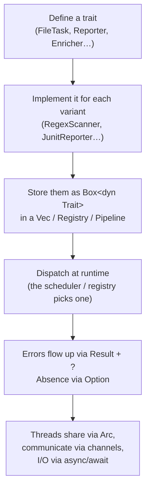

# 9 · Rust Primer — Every Concept exfill Uses

← [Integrations](./integrations.md) · [Back to index](./README.md)

This page teaches the Rust concepts the rest of the guide relies on, each with the
*exact code in exfill that uses it*. You don't need to read it top to bottom — the
other pages link into specific sections. But if you're new to Rust, reading it once
will make everything else click.

Rust's big ideas, in one breath: **the compiler proves your program is memory-safe
and thread-safe before it runs**, using ownership (who owns each value), borrowing
(temporary access without owning), traits (shared behavior), and enums (a value
that is one of several shapes). There is no garbage collector and no null.

---

## Crates and modules {#crates-and-modules}

A **crate** is the unit of compilation — a library or a binary. exfill is a
*workspace* of 14 crates ([overview](./overview.md#1-why-a-cargo-workspace-of-many-crates)).
Inside a crate, code is organized into **modules**. `lib.rs` is the crate root; a
`pub mod ast;` line pulls in `ast.rs` as a submodule
([`scan/lib.rs`](../../crates/exfill-scan/src/lib.rs)).

- `pub` makes an item visible outside its module/crate. No `pub` = private.
- `pub(crate)` means visible within this crate only — e.g. `LangSpec`
  ([`ast.rs:45`](../../crates/exfill-scan/src/ast.rs#L45)) is an internal type.
- `use` brings a path into scope: `use exfill_core::Match;`.

---

## Structs and enums

A **struct** groups named fields. `Match` ([`core/lib.rs:97`](../../crates/exfill-core/src/lib.rs#L97))
is one hit: `rule`, `path`, `line`, `col`, `snippet`, plus optional classification.

### Enums with no data (C-like) {#enums-c-like}

`Severity` ([`core/lib.rs:29`](../../crates/exfill-core/src/lib.rs#L29)) is a closed
set of named values:

```rust
pub enum Severity { Info, Low, Medium, High, Critical }
```

You handle one with `match`, and `match` is **exhaustive** — if you add a variant,
every `match` that doesn't handle it fails to compile. That's a feature: the
compiler finds every place you forgot to update.

### Enums with data (sum types) {#enums-with-data}

This is the one that surprises newcomers and is everywhere in exfill. An enum
variant can *carry a value*, so the enum is "exactly one of these shapes, each with
its own data." `Artifact` ([`task/lib.rs:92`](../../crates/exfill-task/src/lib.rs#L92)):

```rust
pub enum Artifact {
    Bytes(Vec<u8>),            // raw bytes
    Files(Vec<VirtualFile>),   // expanded entries
    Ast(Ast),                  // a parse tree
    Matches(Vec<Match>),       // findings
}
```

One `Artifact` value is *either* bytes *or* an AST *or* findings — never two at
once, never none. You pattern-match to get at the payload:

```rust
match produced {
    Artifact::Matches(mut m) => out.matches.append(&mut m),
    Artifact::Ast(ast)       => out.ast = Some(ast),
    other                    => available.insert(other.kind(), other),
}
```

This models "a value that varies in shape" with *compile-time* guarantees — no
casting, no checking a type tag by hand. The TUI uses the same pattern for `Mode`,
`EditOp`, and `Prompt` ([cli-tui](./cli-tui.md#4-the-graph-navigator)); reversible
undo/redo falls right out of it.

---

## `Option` and the question mark {#option-and-the-question-mark}

Rust has **no null**. A value that might be absent is an
`Option<T>` — either `Some(value)` or `None`. `Match.severity` is
`Option<Severity>` ([`core/lib.rs:111`](../../crates/exfill-core/src/lib.rs#L111)):
a finding may or may not be classified.

You can't accidentally use a missing value — the compiler forces you to handle
`None`. Common tools:

- **`?` on an `Option`** returns `None` from the function early if the value is
  absent. In MCP, `id.as_ref()?;` ([`mcp/lib.rs:66`](../../crates/exfill-mcp/src/lib.rs#L66))
  drops a notification (no id → return `None`).
- **`.or_else(|| ...)`** tries an alternative only if `None` — the AST
  `assignment_parts` chains field lookups this way
  ([`ast.rs:182`](../../crates/exfill-scan/src/ast.rs#L182)).
- **`.map(...)`, `.and_then(...)`, `.unwrap_or(...)`** transform or supply a default.

---

## `Result` and error handling {#result-and-error-handling}

A fallible operation returns `Result<T, E>` — either `Ok(value)` or `Err(error)`.
exfill uses the [`anyhow`](https://docs.rs/anyhow) crate so every error is one type
(`anyhow::Error`) and functions return `Result<T>`.

The **`?` operator** is the workhorse: on `Ok`, it unwraps the value; on `Err`, it
returns the error from the current function. So this:

```rust
let src = std::fs::read_to_string(&path)
    .with_context(|| format!("read config {}", path.display()))?;
```

reads a file, and if it fails, returns an error *annotated* with which file
([`config/lib.rs:98`](../../crates/exfill-config/src/lib.rs#L98)). `with_context`
adds a human message; `bail!("...")` returns an error immediately. This is how the
whole codebase propagates failure without exceptions.

> `.ok()?` converts a `Result` into an `Option` and short-circuits — the Rhai
> enricher uses it so a script *runtime* error becomes "no note" instead of a crash
> ([`script/lib.rs:89`](../../crates/exfill-script/src/lib.rs#L89)).

---

## Traits — shared behavior {#traits}

A **trait** is an interface: a set of methods a type promises to implement. This is
how Rust does polymorphism (there's no class inheritance). `FileTask`
([`task/lib.rs:120`](../../crates/exfill-task/src/lib.rs#L120)) is the plugin
interface — anything implementing `name`/`needs`/`provides`/`run` *is* a plugin.

exfill is built almost entirely on a handful of traits: `FileTask`, `Scanner`,
`Reporter`, `Enricher`, `Viewer`, `Source`, `RemoteFs`, `RunStage`. Define a trait,
implement it, register it — that's the extension pattern everywhere.

### Trait default methods {#trait-default-methods}

A trait can supply a default so implementors only override what differs. `FileTask::applies`
defaults to `true` ([`task/lib.rs:134`](../../crates/exfill-task/src/lib.rs#L134)):

```rust
fn applies(&self, _path: &Path) -> bool { true }
```

Most scanners run on every file and inherit this; the AST scanner overrides it to
run only on source files.

### `Send + Sync` bounds

`pub trait FileTask: Send + Sync` ([`task/lib.rs:120`](../../crates/exfill-task/src/lib.rs#L120))
requires every plugin to be safe to *send* between threads (`Send`) and *share*
between threads (`Sync`). The compiler **proves** this — it's why the
[engine](./engine.md#4-the-two-worlds-concurrency-model) can run plugins on many
threads without data races.

---

## Trait objects — `Box<dyn Trait>` {#box-dyn}

When you need a *list of different types that share a trait*, you use a **trait
object**: `Box<dyn FileTask>`. The `Pipeline` holds
`Vec<Box<dyn FileTask>>` ([`task/lib.rs:148`](../../crates/exfill-task/src/lib.rs#L148))
— a heterogeneous list of different plugin types, each behind the `FileTask`
interface.

- `dyn FileTask` = "some type implementing `FileTask`, decided at runtime" —
  dispatched through a vtable (a table of function pointers).
- `Box<...>` puts it on the heap, because different implementors have different
  sizes and a `Vec` needs uniform-sized elements.

The same pattern holds every plugin list: `Vec<Box<dyn Viewer>>`
([view](./cli-tui.md#6-pluggable-viewers-exfill-view)), `Vec<Box<dyn Source>>`,
`&[Box<dyn RunStage>]`. Trait objects are how a plugin architecture works in Rust.

---

## Generics {#generics}

Where trait objects choose a type at *runtime*, **generics** choose at *compile
time* and get specialized code. `ScanTask<S: Scanner>`
([`scan/lib.rs:66`](../../crates/exfill-scan/src/lib.rs#L66)) works for any `S` that
implements `Scanner`.

The store uses generics to steer the database: `res.take(0)?` deserializes rows
into whatever type you annotate — `let rows: Vec<FileStat> = res.take(0)?;`
([`store/lib.rs:139`](../../crates/exfill-store/src/lib.rs#L139)). The config's
`plugin::<T>` ([`config/lib.rs:115`](../../crates/exfill-config/src/lib.rs#L115))
decodes a TOML table into any type you ask for.

---

## Ownership, borrowing, lifetimes {#ownership}

This is Rust's core idea. Every value has exactly one **owner**; when the owner goes
out of scope, the value is freed — no GC, no manual `free`. You can lend temporary
access with a **borrow**:

- `&T` — a shared (read-only) borrow. Many at once.
- `&mut T` — an exclusive (mutable) borrow. Only one at a time.

Most methods take `&self` and borrow their arguments (`&Path`, `&str`, `&Match`) so
they don't take ownership; the store clones only when handing data to the database.
This is why you see `&` everywhere.

**Lifetimes** name how long a borrow is valid. Usually inferred; occasionally
written as `'a` or the anonymous `'_`, as in `Formatter<'_>`
([`task/lib.rs:152`](../../crates/exfill-task/src/lib.rs#L152)). `&'static`
([`ast.rs:47`](../../crates/exfill-scan/src/ast.rs#L47)) means "lives for the whole
program" — the `LangSpec` table is `&'static` because it's baked into the binary.

### `move` closures {#move-closures}

A **closure** is an anonymous function that can capture variables. `move` transfers
*ownership* of the captures into the closure — essential for threads, since a thread
may outlive the code that spawned it. The engine's per-thread worker is
`Box::new(move |entry| ...)` ([`engine/lib.rs:170`](../../crates/exfill-engine/src/lib.rs#L170)):
each thread owns its cloned `tx`/`host`/`index`, so no thread borrows another's
locals — the compiler enforces it.

---

## Concurrency: threads, `Arc`, channels {#concurrency}

exfill mixes two concurrency models on purpose
([engine](./engine.md#4-the-two-worlds-concurrency-model)):

- **Threads** for CPU-bound file work (the parallel walk).
- **`Arc<T>`** — an *atomically reference-counted* shared pointer — lets many
  threads share one read-only value. The stat index is `Arc<HashMap<...>>`
  ([`engine/lib.rs:152`](../../crates/exfill-engine/src/lib.rs#L152)); cloning an
  `Arc` just bumps a counter, it doesn't copy the map.
- **`Arc<Mutex<T>>`** when the shared value must be *mutated* — the report sink is
  `Arc<Mutex<dyn Write + Send>>` ([`run.rs:121`](../../crates/exfill-engine/src/run.rs#L121)).
- **Channels (`mpsc`)** pass values between threads. Worker threads send
  `WalkOutcome`s; the main task receives them
  ([`engine/lib.rs:161`](../../crates/exfill-engine/src/lib.rs#L161)). Dropping the
  last sender closes the channel — that's the loop's natural end.

---

## Async / await {#async-await}

`async fn` marks a function that can *pause* (at `.await` points) without blocking a
thread — ideal for I/O like database and network calls. The store and MCP are async;
`scan()` is `async` ([`engine/lib.rs:139`](../../crates/exfill-engine/src/lib.rs#L139)).
The [tokio](https://tokio.rs) runtime drives these futures.

### `#[async_trait]` {#async-traits}

A plain `async fn` inside a trait can't yet be used behind `dyn` (a technical "object
safety" limit). The `#[async_trait]` macro rewrites each async trait method to
return a boxed future, which *is* object-safe — so `Box<dyn RunStage>` works
([`run.rs:41`](../../crates/exfill-engine/src/run.rs#L41)). You'll see it on
`RunStage`, `RemoteFs`, and `Source`.

### Bridging async and blocking

The TUI is blocking but needs async store calls, so it runs on `spawn_blocking` with
a tokio `Handle`: `handle.block_on(fut)` runs one async op to completion,
`handle.spawn(fut)` launches a background task
([cli-tui](./cli-tui.md#2-the-asyncblocking-bridge)).

---

## Derive macros {#derive-macros}

`#[derive(...)]` auto-generates trait implementations at compile time — no
reflection, no runtime cost. Common ones in exfill:

```rust
#[derive(Debug, Clone, Copy, PartialEq, Eq, Serialize, Deserialize)]
pub enum Severity { ... }
```

- `Debug` → printable with `{:?}`.
- `Clone` / `Copy` → duplicable (`Copy` for cheap, bitwise-copyable types).
- `PartialEq` / `Eq` → comparable with `==`.
- `Hash` → usable as a `HashMap`/`HashSet` key (that's why `ArtifactKind` derives it
  — [`task/lib.rs:33`](../../crates/exfill-task/src/lib.rs#L33)).
- `Serialize` / `Deserialize` → convertible to/from JSON/TOML via
  [serde](https://serde.rs). Attributes like `#[serde(default)]` and
  `#[serde(rename = "ref")]` ([`config/lib.rs:57`](../../crates/exfill-config/src/lib.rs#L57),
  because `ref` is a keyword) tune the mapping.

---

## The newtype pattern {#newtype-pattern}

Wrapping a type in a one-field struct to add behavior without touching the original.
`ScanTask<S: Scanner>(pub S)` ([`scan/lib.rs:66`](../../crates/exfill-scan/src/lib.rs#L66))
wraps any `Scanner` to give it a `FileTask` impl — adapting one interface to another
cleanly.

---

## Conditional compilation {#conditional-compilation}

`#[cfg(...)]` compiles code only for certain targets. `ownership()` has three
definitions — `#[cfg(unix)]`, `#[cfg(windows)]`, and a fallback
([`platform.rs:31`](../../crates/exfill-core/src/platform.rs#L31)) — and exactly one
is compiled per platform. `#[cfg(test)]` marks test-only code, so tests don't ship
in the release binary. `#[tokio::test]` and `#[cfg(unix)]` gate individual tests.

---

## Putting the idioms in context

If you've read this page, here's the recurring shape of the whole codebase:



Every crate is a variation on this. Once the pattern is familiar, a new feature is
almost always "one more trait impl" — which is exactly the point of the design.

---

← [Integrations](./integrations.md) · [Back to the index](./README.md)
