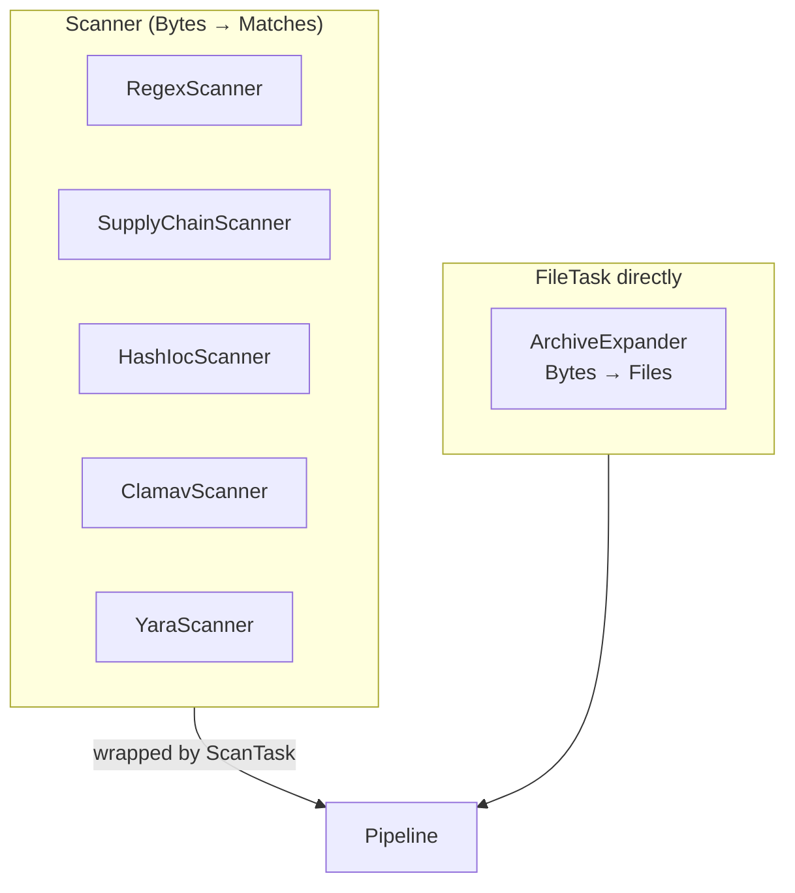
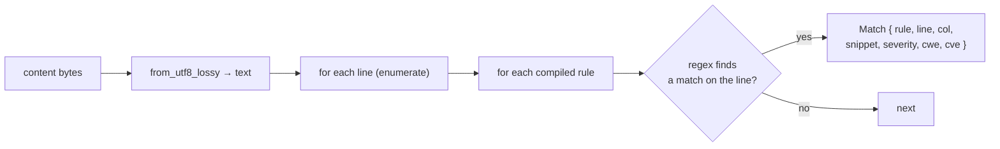
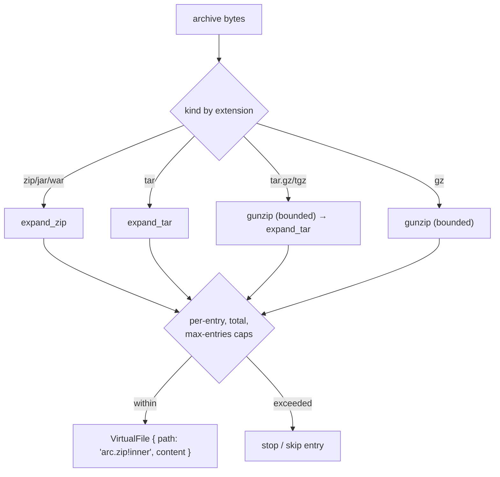
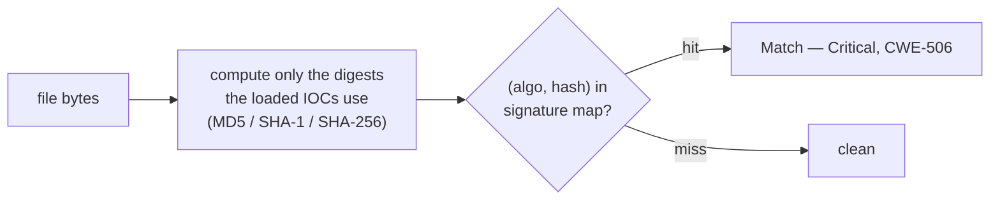
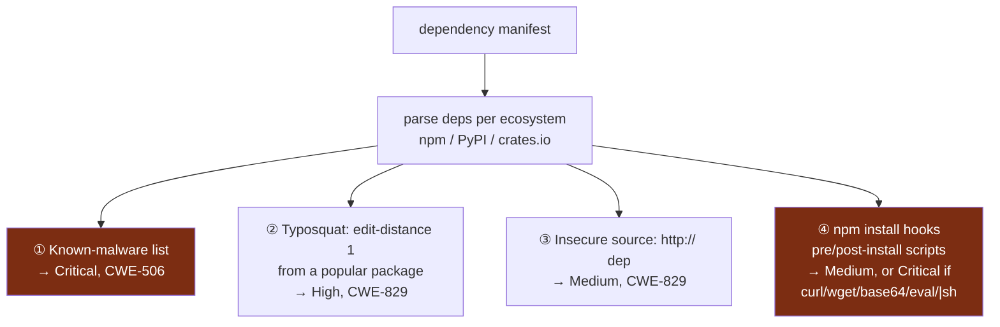
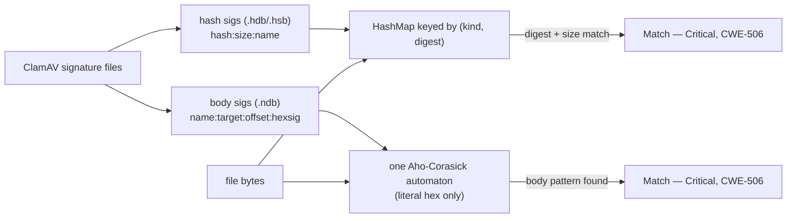
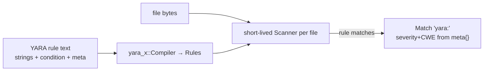
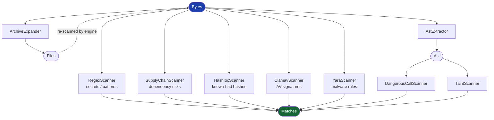

# 5 · The Other Scanners (`exfill-scan`)

← [Taint analysis](./taint.md) · Next: [The graph store →](./store.md)

Beyond the [AST](./ast.md) and [taint](./taint.md) scanners, `exfill-scan` ships
six more detection plugins. This page covers each one: what it finds, how, and the
safety limits that keep hostile input from turning a scan into a denial of
service.

Source: [`crates/exfill-scan/src/`](../../crates/exfill-scan/src/) —
`lib.rs` (regex + wiring), `expand.rs`, `ioc.rs`, `supply.rs`, `clamav.rs`,
`yara.rs`.

---

## 1. Two plugin shapes: `Scanner` vs `FileTask`

Most scanners share a simpler interface than the raw `FileTask`. The `Scanner`
trait ([`lib.rs:51`](../../crates/exfill-scan/src/lib.rs#L51)) is a
content-in-matches-out shape:

```rust
pub trait Scanner: Send + Sync {
    fn name(&self) -> &str;
    fn applies(&self, path: &Path) -> bool;
    fn scan(&self, path: &Path, content: &[u8]) -> Result<Vec<Match>>;
}
```

A `ScanTask<S>` newtype ([`lib.rs:66`](../../crates/exfill-scan/src/lib.rs#L66))
wraps any `Scanner` into a `FileTask` that declares `Bytes → Matches`. So every
detection scanner is a `Scanner`; only the archive expander (`Bytes → Files`)
implements `FileTask` directly.



> **Rust idiom — the newtype wrapper.** `ScanTask<S: Scanner>(pub S)` adds a trait
> impl (`FileTask`) to any scanner without modifying it — a clean way to adapt one
> interface to another. See the [primer](./rust-primer.md#newtype-pattern).

Two pipeline builders assemble these:
`default_pipeline()` ([`lib.rs:98`](../../crates/exfill-scan/src/lib.rs#L98)) uses
built-in rules only (expander, regex, supply-chain, AST, taint);
`pipeline_with_rules(...)` ([`lib.rs:116`](../../crates/exfill-scan/src/lib.rs#L116))
is the full lineup that also wires IOC, ClamAV, and YARA from loaded datasets, and
returns the names of any regex rules it had to skip.

---

## 2. RegexScanner — secrets and patterns

The workhorse. It matches configured regex `Rule`s against file content, line by
line ([`lib.rs:204`](../../crates/exfill-scan/src/lib.rs#L204)).



Details that matter:

- **Line-oriented** — one match per line per rule, with a 1-based char column
  ([`lib.rs:218`](../../crates/exfill-scan/src/lib.rs#L218)). The matched line is
  the snippet.
- **Rust `regex`, not PCRE** — the `regex` crate has no backtracking, so no
  lookahead/lookbehind. External rule sets (like gitleaks) that use those features
  won't compile.
- **Strict vs lenient loading** — `new` ([`lib.rs:154`](../../crates/exfill-scan/src/lib.rs#L154))
  fails fast on any bad pattern (good for built-in rules); `new_lenient`
  ([`lib.rs:171`](../../crates/exfill-scan/src/lib.rs#L171)) collects the *names* of
  patterns it couldn't compile and carries on (good for third-party datasets that
  may use unsupported syntax).
- **Hash-IOC rules are skipped here** — a rule whose pattern is `sha256:...` isn't
  a regex, it's an [IOC hash](#4-hashiocscanner-known-bad-file-hashes). Both
  loaders skip those via `ioc::is_hash_ioc`, the single source of truth that keeps
  the two scanners from double-handling a rule.

The built-in secret rules live in
[`builtin.rs`](../../crates/exfill-scan/src/builtin.rs) (AWS keys, GitHub tokens,
etc.) and are what `default_pipeline` scans with.

---

## 3. ArchiveExpander — looking inside containers {#archive-safety}

A `.zip` (or `.tar`, `.tar.gz`, `.gz`, `.jar`, `.war`) is a container: the
expander turns it into in-memory `VirtualFile`s the [engine](./engine.md#archives)
re-processes. It is the one detection-adjacent plugin that produces `Files`, not
`Matches`.

The interesting part is **defending against hostile archives**. Limits
([`expand.rs:29`](../../crates/exfill-scan/src/expand.rs#L29)) bound the work:

| Limit | Default | Guards against |
|-------|---------|----------------|
| `per_entry` | 32 MiB | A single huge entry / decompression bomb |
| `total` | 256 MiB | Many entries summing to a huge payload |
| `max_entries` | 10,000 | Archives with millions of tiny entries |



Two safety notes worth internalizing:

- **Decompression is bounded at the source.** `gunzip` wraps the decoder in
  `.take(cap)` ([`expand.rs:127`](../../crates/exfill-scan/src/expand.rs#L127)), so
  a 10 KB gz that expands to 10 GB is cut off — it can't exhaust memory.
- **Zip-slip has no filesystem effect.** Entry names may contain `../` or absolute
  paths, but they are only used to build a *display path*
  `container!inner` ([`expand.rs:121`](../../crates/exfill-scan/src/expand.rs#L121)).
  Nothing is written to disk — expanded entries are `VirtualFile`s in memory — so a
  malicious entry name can't escape a directory. Safety is by construction.

---

## 4. HashIocScanner — known-bad file hashes

An IOC (Indicator of Compromise) feed lists hashes of known-malicious files. This
scanner ([`ioc.rs:69`](../../crates/exfill-scan/src/ioc.rs#L69)) computes each
file's digest and looks it up:



- **Only the needed algorithms are computed.** If the feed has only SHA-256 IOCs,
  only SHA-256 is hashed ([`ioc.rs:130`](../../crates/exfill-scan/src/ioc.rs#L130)).
  `applies` returns false when no hash IOCs are loaded, so hashing is skipped
  entirely.
- **`is_hash_ioc`** ([`ioc.rs:40`](../../crates/exfill-scan/src/ioc.rs#L40)) parses
  a rule pattern like `sha256:abcd...`, validating the hex length matches the
  algorithm. This same function is what the regex scanner uses to *exclude* IOC
  rules — one definition, no drift.
- It is a pure hash-map lookup — no scanning of content, so it works on binary
  files too.

---

## 5. SupplyChainScanner — dependency risks, offline

This scanner ([`supply.rs:166`](../../crates/exfill-scan/src/supply.rs#L166))
inspects dependency manifests — `package.json` (npm), `Cargo.toml` (crates.io),
`requirements*.txt` (PyPI) — with **no network feeds**, using four offline
heuristics:



- **Typosquatting** is detected with **Damerau-Levenshtein (OSA) edit distance
  == 1** ([`supply.rs:97`](../../crates/exfill-scan/src/supply.rs#L97)) against a
  curated list of popular packages: `reqeusts` (for `requests`), `loadash` (for
  `lodash`), etc. Names that *are* themselves popular are excluded so `react`
  doesn't flag as a typo of `preact`.
- **Install hooks** are npm's classic supply-chain vector. A `postinstall` script
  is Medium by default, escalated to **Critical** if it contains red-flag tokens
  like `curl`, `wget`, `base64`, `eval(`, `| sh`
  ([`supply.rs:89`](../../crates/exfill-scan/src/supply.rs#L89)).

Each ecosystem has its own parser (JSON for npm, TOML for crates.io, line-based
for PyPI), and unparseable manifests are silently ignored rather than erroring.

---

## 6. ClamavScanner — antivirus signatures

exfill can consume a subset of [ClamAV](https://www.clamav.net/) signatures
([`clamav.rs:39`](../../crates/exfill-scan/src/clamav.rs#L39)) — the open antivirus
database format:



- **Hash signatures** match a file's MD5/SHA-256 with an optional exact-size gate
  ([`clamav.rs:149`](../../crates/exfill-scan/src/clamav.rs#L149)).
- **Body signatures** are literal hex byte-strings compiled into a single
  [Aho-Corasick](https://docs.rs/aho-corasick) automaton — one pass finds any of
  thousands of patterns. ClamAV *wildcard* syntax (`*`, `?`, `{...}`) is **not**
  supported; such signatures are skipped and counted
  ([`clamav.rs:215`](../../crates/exfill-scan/src/clamav.rs#L215)).
- Because Aho-Corasick runs on raw bytes, body sigs match **binary** files —
  unlike the text-oriented regex scanner.

---

## 7. YaraScanner — the malware-analyst's language

[YARA](https://virustotal.github.io/yara/) is the standard rule language for
describing malware families. exfill uses **`yara-x`**
([`yara.rs:21`](../../crates/exfill-scan/src/yara.rs#L21)) — a *pure-Rust* YARA
engine, so there's no C `libyara` dependency:



- Rules are compiled once from concatenated source; empty source yields an inert
  scanner ([`yara.rs:29`](../../crates/exfill-scan/src/yara.rs#L29)).
- A fresh `yara_x::Scanner` is created per file (the compiled `Rules` are
  `Send + Sync`, the scanner is not).
- A finding's rule id is `yara:<identifier>`; its severity and CWE come from the
  rule's `meta` block ([`yara.rs:78`](../../crates/exfill-scan/src/yara.rs#L78)),
  defaulting to High if unspecified.

---

## 8. The full detection lineup

Putting all scanners on one canvas, by the artifact they consume:



Every one of these is a plugin on the same [DAG](./pipeline.md); adding the next
one is the same recipe. The [engine](./engine.md) runs whichever are in the
pipeline over every file, and their `Match`es all flow into the
[graph store](./store.md) next.
