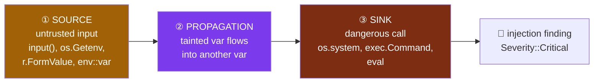
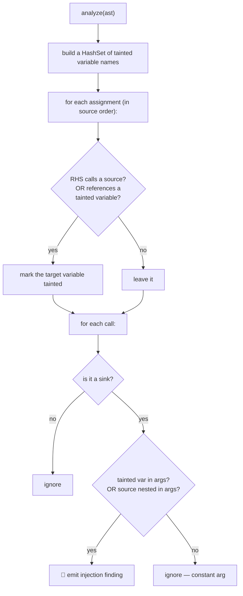
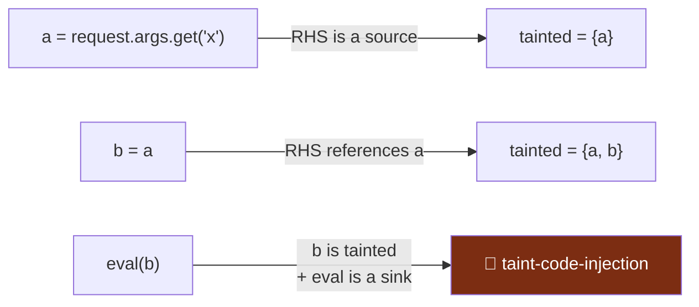
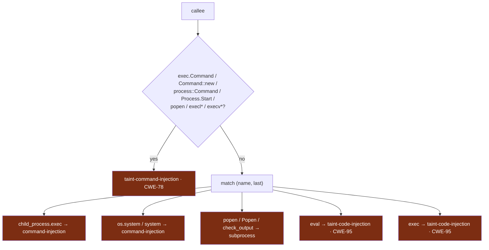

# 4 · Taint Analysis (`exfill-scan::taint`)

← [The AST scanner](./ast.md) · Next: [The other scanners →](./scanners.md)

The [AST scanner](./ast.md) flags *any* call to a dangerous sink. Taint analysis
asks the sharper, higher-confidence question: **does attacker-controlled data
actually flow into that sink?** A call to `os.system("ls")` is fine;
`os.system(user_input)` is a command-injection bug. Taint tracking tells them
apart.

Source: [`crates/exfill-scan/src/taint.rs`](../../crates/exfill-scan/src/taint.rs)
(259 lines).

---

## 1. Source → propagation → sink

Classic taint analysis has three ingredients:



1. **Sources** produce tainted data — `is_source`
   ([`taint.rs:36`](../../crates/exfill-scan/src/taint.rs#L36)).
2. **Propagation** spreads taint through assignments — the forward pass in
   `analyze` ([`taint.rs:119`](../../crates/exfill-scan/src/taint.rs#L119)).
3. **Sinks** are where tainted data becomes dangerous — `taint_sink`
   ([`taint.rs:69`](../../crates/exfill-scan/src/taint.rs#L69)).

Crucially, this task consumes the `Ast` the extractor **already produced** — it is
an `Ast → Matches` plugin, so it adds *no extra parse*
([`taint.rs:1-12`](../../crates/exfill-scan/src/taint.rs#L1)). It reuses the
`calls` and `assigns` facts the [AST walk](./ast.md#5-extraction-walking-the-tree)
recorded.

---

## 2. The algorithm

`analyze` ([`taint.rs:119`](../../crates/exfill-scan/src/taint.rs#L119)) is a
**single forward pass**, intentionally simple and cheap:



In code, the propagation pass ([`taint.rs:122-129`](../../crates/exfill-scan/src/taint.rs#L122)):

```rust
let mut tainted: HashSet<&str> = HashSet::new();
for a in &ast.assigns {
    let from_source  = a.rhs_calls.iter().any(|c| is_source(c));
    let from_tainted = a.rhs_idents.iter().any(|i| tainted.contains(i.as_str()));
    if from_source || from_tainted {
        tainted.insert(a.target.as_str());
    }
}
```

Then the sink check ([`taint.rs:132-156`](../../crates/exfill-scan/src/taint.rs#L132)):
a call is flagged if a tainted variable is among its arguments (`via_var`), or a
source call is nested directly in its arguments like `os.system(input())`
(`direct`).

Worked example (`a = request.args.get('x'); b = a; eval(b)`):



The `transitive_taint_across_two_vars` test
([`taint.rs:214`](../../crates/exfill-scan/src/taint.rs#L214)) is exactly this
case. And `untainted_constant_is_not_flagged`
([`taint.rs:221`](../../crates/exfill-scan/src/taint.rs#L221)) proves the opposite:
`cmd = 'ls -la'; os.system(cmd)` produces **nothing**, because `cmd` was never
tainted.

---

## 3. What counts as a source

`is_source` ([`taint.rs:36`](../../crates/exfill-scan/src/taint.rs#L36)) recognizes
untrusted-input surfaces across languages:

| Language | Sources |
|----------|---------|
| Python | `input`, `raw_input`, `request.*`, `os.environ` |
| JS/Node | `process.argv`, `process.env`, `req.body`/`req.query`/`req.params` |
| Go | `os.Args`, `os.Getenv`, `r.FormValue`, `r.URL.Query` |
| Rust | `std::env::var`, `std::env::args` |
| C# | `Console.ReadLine`, `Request.Query`, `Request.Form`, `QueryString` |

There's a subtlety the code handles: most sources are **member reads**
(`os.Args`, `process.argv`), not calls. The [AST walk](./ast.md) records member
accesses as source-check candidates ([`ast.rs:216`](../../crates/exfill-scan/src/ast.rs#L216))
precisely so `process.argv[2]` is recognized as untrusted.

---

## 4. What counts as a sink

`taint_sink` ([`taint.rs:69`](../../crates/exfill-scan/src/taint.rs#L69)) mirrors
the dangerous-call sinks but classifies them as injection when fed taint. It uses
the same **cross-language prefix check first, then `match`** structure as
`sink_for`:



The prefix check ([`taint.rs:74-87`](../../crates/exfill-scan/src/taint.rs#L74))
exists because of a real bug: Go's `exec.Command` has *last component* `Command`,
which matched no `match` arm, so Go taint silently returned nothing. Checking the
full callee text first fixed it — and `go_taint_from_form_value`
([`ast.rs:709`](../../crates/exfill-scan/src/ast.rs#L709)) now proves
`c := r.FormValue("cmd"); exec.Command(c)` is flagged.

Every taint finding is `Severity::Critical`
([`taint.rs:151`](../../crates/exfill-scan/src/taint.rs#L151)) — a proven data flow
from untrusted input to a dangerous sink is the real, exploitable bug, not a
maybe.

---

## 5. Honest limitations

The module documents its own blind spots
([`taint.rs:24-25`](../../crates/exfill-scan/src/taint.rs#L24)), and that honesty
is a feature:

- **Intra-file only** — no cross-function or cross-file flow.
- **Flow-insensitive** — a single forward pass; it doesn't reason about branches
  or order beyond "assignments in source order."
- **Call expressions only** — subscript sources like `sys.argv[1]` aren't fully
  modeled.

The guiding principle is **false negatives over false positives**: it would rather
miss a convoluted flow than cry wolf on a safe one. A noisy scanner gets ignored;
a quiet, high-confidence one gets trusted.

---

**Next:** [the other scanners](./scanners.md) — regex secrets, archive expansion,
IOC hashes, supply-chain checks, ClamAV, and YARA — round out the detection
lineup.
