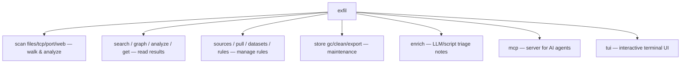
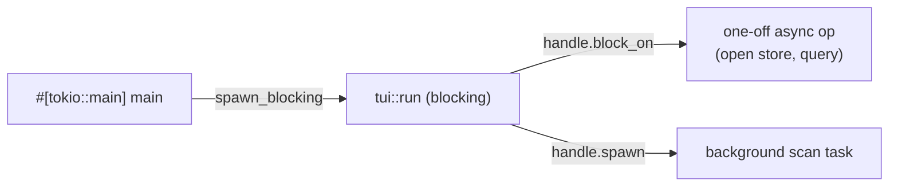
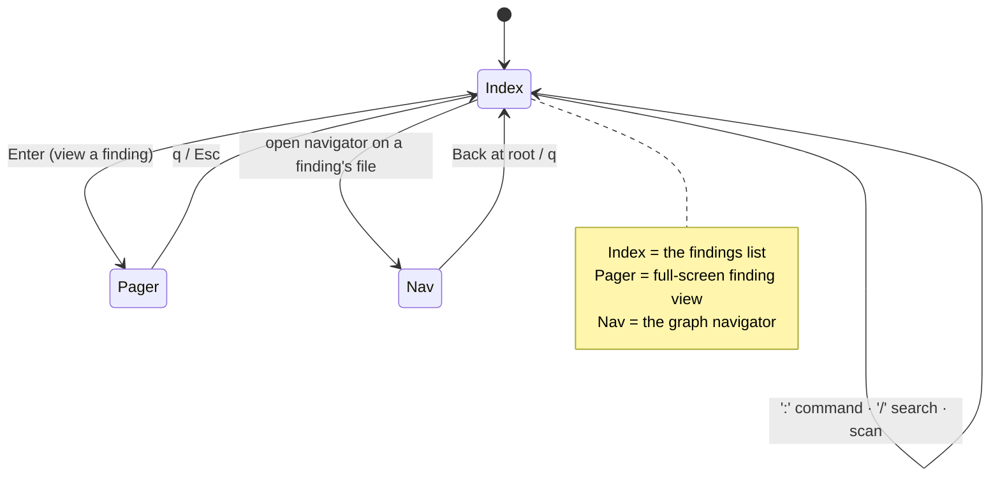
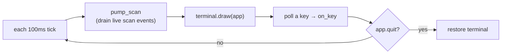
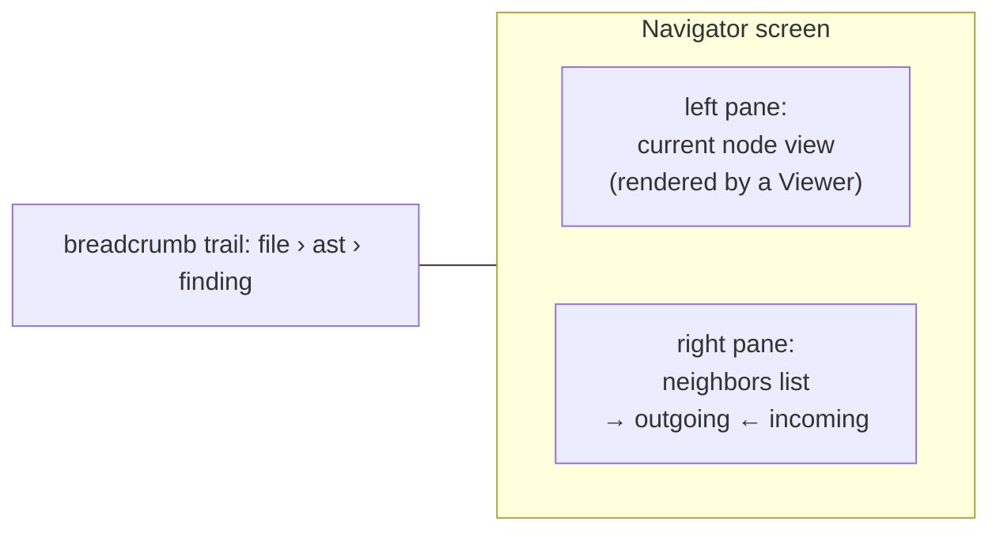
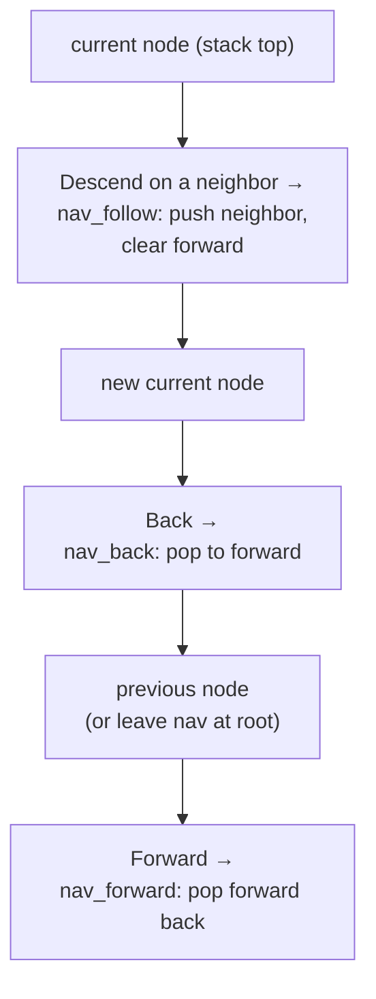
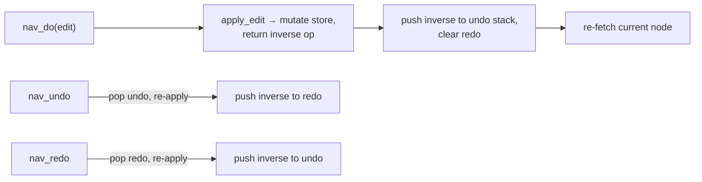
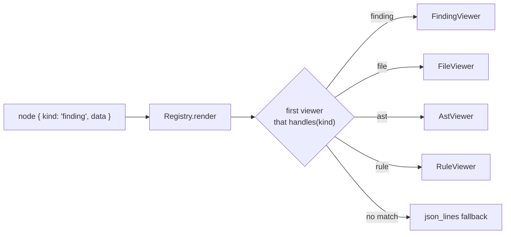
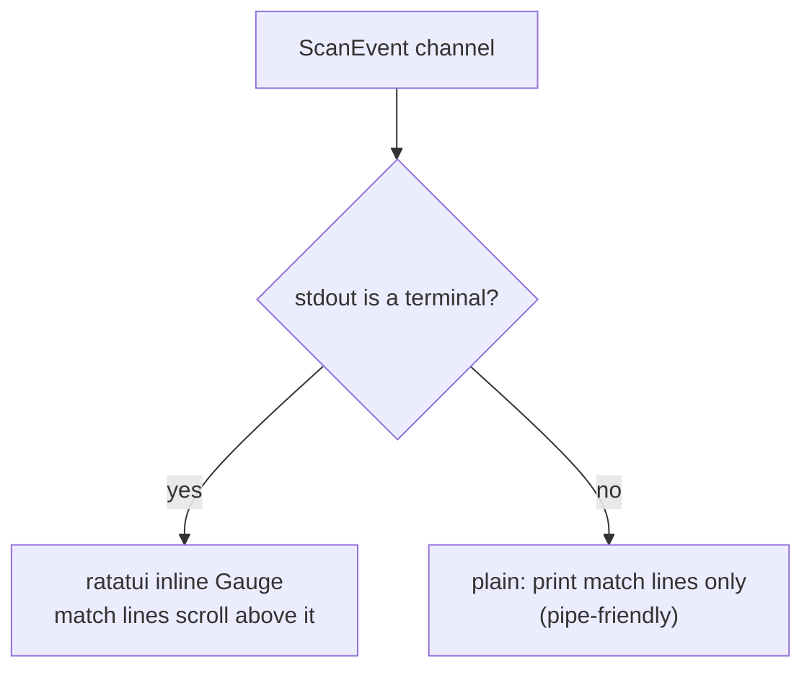

# 7 · CLI, TUI & Graph Navigator (`exfil-cli`)

← [The graph store](./store.md) · Next: [Integrations →](./integrations.md)

`exfil-cli` is the one **binary** — the executable a user actually runs. It parses
arguments, wires every other crate together, and hosts a mutt-style terminal UI
with a vim-style graph navigator. This page maps the commands, then dissects the
TUI.

Source: [`crates/exfil-cli/src/`](../../crates/exfil-cli/src/) — `main.rs`
(commands), `tui.rs` (the UI), `keymap.rs` (bindings), `progress.rs` (the gauge).

---

## 1. The command surface

`main.rs` uses [clap](https://docs.rs/clap) to declare subcommands. Two global
flags apply to all: `-s/--store` (findings store path, default `.exfil`) and
`-c/--config` (config file).



| Command | Does | Handler |
|---------|------|---------|
| `scan [files] [path]` | Walk a tree, scan, persist; live progress | [`main.rs`](../../crates/exfil-cli/src/main.rs) |
| `scan files --remote <target>` | Scan a host over SSH (`-p` port, `-k` key; `$EXFIL_SSH_PASSWORD`) | [`main.rs`](../../crates/exfil-cli/src/main.rs) |
| `search [query]` | Query stored findings (`field=value` or free text) | [`main.rs:410`](../../crates/exfil-cli/src/main.rs#L410) |
| `analyze [query] -f <fmt>` | Render a report (`text`/`json`/`markdown`/`junit`) | [`main.rs:423`](../../crates/exfil-cli/src/main.rs#L423) |
| `graph [query] -f <fmt>` | Emit the findings graph as JSON or DOT | [`main.rs:439`](../../crates/exfil-cli/src/main.rs#L439) |
| `get <id>` | Print one record by id as JSON | [`main.rs:534`](../../crates/exfil-cli/src/main.rs#L534) |
| `datasets [list/show/add/rm]` | Manage the rule catalog | [`main.rs:350`](../../crates/exfil-cli/src/main.rs#L350) |
| `pull [ref]` / `sources` / `rules` | Fetch datasets / list sources / show built-in rules | [`main.rs:317`](../../crates/exfil-cli/src/main.rs#L317) / `302` / `544` |
| `enrich` | Run offline LLM/script triage over findings | [`main.rs:468`](../../crates/exfil-cli/src/main.rs#L468) |
| `store gc` / `clean` / `export -o -f` | Prune / delete store / snapshot (CBOR or JSON) | [`main.rs`](../../crates/exfil-cli/src/main.rs) |
| `mcp` | Serve MCP over stdio for AI agents | [`main.rs:149`](../../crates/exfil-cli/src/main.rs#L149) |
| `tui` | Open the interactive UI | [`main.rs:155`](../../crates/exfil-cli/src/main.rs#L155) |

`main` is `#[tokio::main]` ([`main.rs:129`](../../crates/exfil-cli/src/main.rs#L129))
— async, because the store and network are async. `build_pipeline`
([`main.rs:244`](../../crates/exfil-cli/src/main.rs#L244)) assembles the scanners
from built-in rules + catalog datasets + ClamAV/YARA files.

---

## 2. The async/blocking bridge

The TUI is *blocking* (it owns the terminal and polls keys in a loop), but the rest
of exfil is *async*. The bridge: run the TUI on a dedicated blocking thread via
`spawn_blocking`, handing it a tokio `Handle` so it can run async store operations
on demand.



`handle.block_on(...)` runs one async operation to completion (e.g. opening the
store); `handle.spawn(...)` launches a background scan whose events stream back into
the UI. See the [primer on async](./rust-primer.md#async-await).

---

## 3. The TUI: a mode state machine

The UI is a **state machine** driven by keypresses. `App`
([`tui.rs:249`](../../crates/exfil-cli/src/tui.rs#L249)) holds all state; `Mode`
([`tui.rs:161`](../../crates/exfil-cli/src/tui.rs#L161)) is which screen you're in:



The event loop ([`tui.rs:959`](../../crates/exfil-cli/src/tui.rs#L959)) is one tick:



It is deliberately **backend-generic** (`B: Backend`) and takes the key source as a
closure ([`tui.rs:959`](../../crates/exfil-cli/src/tui.rs#L959)), which is what lets
tests drive the whole UI against a `TestBackend` with scripted keystrokes — no real
terminal needed. There is an end-to-end navigator test that follows edges, goes
back/forward, edits with undo/redo, and deletes an edge
([`tui.rs:1077`](../../crates/exfil-cli/src/tui.rs#L1077)).

A mutt-style command bar handles `:` commands, `/` search, and `set field=value`
edits, parsed by `parse_command` ([`tui.rs:95`](../../crates/exfil-cli/src/tui.rs#L95))
and run by `execute` ([`tui.rs:581`](../../crates/exfil-cli/src/tui.rs#L581)). A
background scan started from the UI streams `ScanEvent::Match` into the findings
list *live* via `pump_scan` ([`tui.rs:659`](../../crates/exfil-cli/src/tui.rs#L659)).

---

## 4. The graph navigator {#navigator}

The navigator is "vim/neovim for the findings graph." You start on a finding's
file, then *follow edges* between nodes — file → its AST → back → the scan that
included it — editing and searching as you go. It is built entirely on the store's
[`neighbors`](./store.md#5-traversal-neighbors-the-navigators-engine) method.



State lives in `NavState` ([`tui.rs:210`](../../crates/exfil-cli/src/tui.rs#L210)):

- **`stack`** — the breadcrumb trail; the last entry is the current node.
- **`forward`** — the jumplist for redo/forward after going back.
- **`undo` / `redo`** — paired stacks of reversible edits.

The motions:



- **Follow an edge**: `nav_follow` ([`tui.rs:392`](../../crates/exfil-cli/src/tui.rs#L392))
  builds the selected neighbor's node, pushes it on `stack`, clears `forward`.
- **Jumplist back/forward**: `nav_back` ([`tui.rs:408`](../../crates/exfil-cli/src/tui.rs#L408))
  and `nav_forward` ([`tui.rs:423`](../../crates/exfil-cli/src/tui.rs#L423)) move
  nodes between `stack` and `forward` — exactly vim's `Ctrl-o`/`Ctrl-i` jumplist.

### CRUD with undo/redo

Every edit is a **reversible operation**, `EditOp`
([`tui.rs:190`](../../crates/exfil-cli/src/tui.rs#L190)): set a field, or
create/delete an edge. Applying one *returns its inverse*
([`apply_edit`, tui.rs:453](../../crates/exfil-cli/src/tui.rs#L453)):



Setting a field returns a "set it back to the old value" op; creating an edge
returns a "delete it" op. Undo just applies the inverse and pushes *its* inverse to
redo — a clean, symmetric design. See
[state machines](./rust-primer.md#enums-with-data) for why enums model this so
well.

---

## 5. Configurable keybindings (`keymap.rs`)

The navigator's keys default to vim but are fully remappable. `NavAction`
([`keymap.rs:15`](../../crates/exfil-cli/src/keymap.rs#L15)) is the set of
abstract actions; `Keymap` ([`keymap.rs:78`](../../crates/exfil-cli/src/keymap.rs#L78))
maps key strings to them.

Defaults ([`keymap.rs:84`](../../crates/exfil-cli/src/keymap.rs#L84)):

| Keys | Action | Keys | Action |
|------|--------|------|--------|
| `j` / `↓` | Down | `k` / `↑` | Up |
| `h` / `←` | Ascend | `l` / `→` / `Tab` / `Enter` | Descend (follow) |
| `<` / `Backspace` | Back | `>` | Forward |
| `c` | Edit | `d` | DeleteEdge |
| `u` | Undo | `U` | Redo |
| `q` / `i` / `Esc` | Quit | | |

Remapping is a `[keymap.nav]` TOML table
([`keymap.rs:115`](../../crates/exfil-cli/src/keymap.rs#L115)): each `key =
"ActionName"` overlays the defaults. Unknown action names are silently ignored, so
a typo can't break your keymap — it just doesn't take effect.

```toml
[keymap.nav]
x = "Edit"        # bind x to edit instead of c
```

---

## 6. Pluggable viewers (`exfil-view`)

How a node is *rendered* in the navigator's left pane is itself pluggable. A
`Viewer` ([`view/src/lib.rs:45`](../../crates/exfil-view/src/lib.rs#L45)) turns a
node's stored JSON into display lines; a `Registry`
([`view/src/lib.rs:57`](../../crates/exfil-view/src/lib.rs#L57)) picks the first
viewer that `handles` a node's kind.



Viewers render purely from JSON — terminal-agnostic, no ANSI (the caller styles) —
which is why they're a separate crate with no UI dependency. Registering a custom
viewer for a new kind takes precedence for that kind; there's a test where a
`HexViewer` handles a `"blob"` kind
([`view/src/lib.rs:289`](../../crates/exfil-view/src/lib.rs#L289)).

---

## 7. The progress gauge (`progress.rs`) {#progress}

When you run `exfil scan`, the [engine](./engine.md#9-live-progress-the-scanevent-channel)
streams `ScanEvent`s; `progress.rs` renders them. It picks its renderer based on
whether stdout is a terminal ([`progress.rs:82`](../../crates/exfil-cli/src/progress.rs#L82)):



The interactive path uses a ratatui `Gauge` on an inline 1-line viewport, inserting
each match *above* the moving gauge via `terminal.insert_before`
([`progress.rs:131`](../../crates/exfil-cli/src/progress.rs#L131)) so hits stay in
scrollback while the bar advances. The non-terminal path prints only match lines,
so `exfil scan | grep ...` works cleanly. Both run on a dedicated OS thread and
shut down when the event channel closes.

---

**Next:** [Integrations](./integrations.md) — the MCP server for AI agents, offline
LLM and Rhai-script enrichment, remote SSH scanning, and the report formats
(including the [JUnit output](./integrations.md#reporting) for CI).
