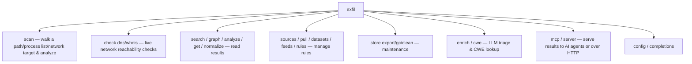
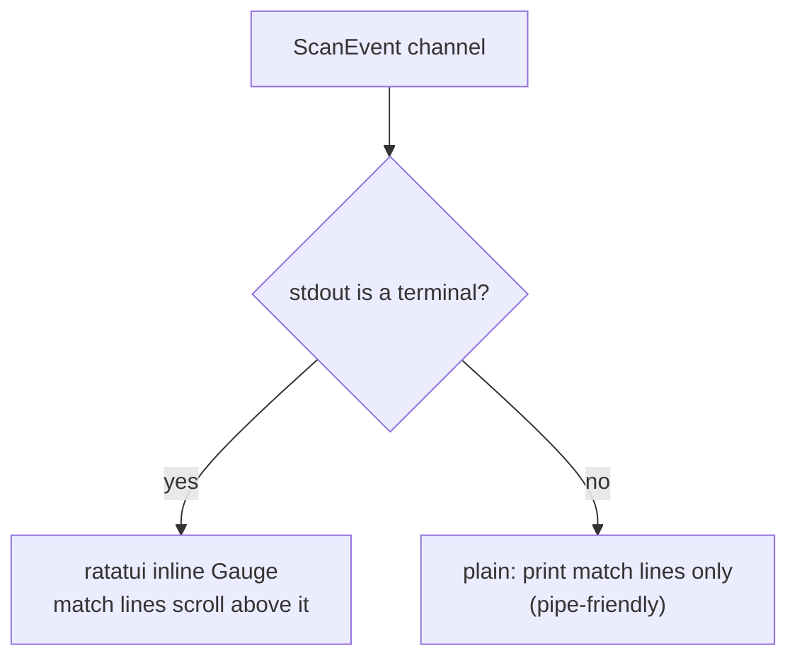

# 7 · The CLI (`exfil-cli`)

← [The graph store](./store.md) · Next: [Integrations →](./integrations.md)

`exfil-cli` is the one **binary** — the executable a user actually runs. It parses
arguments and wires every other crate together. This page maps the commands, then
covers the interactive progress gauge shown during a scan.

Source: [`crates/exfil-cli/src/`](../../crates/exfil-cli/src/) — `main.rs`
(commands), `progress.rs` (the gauge), `server.rs` (the HTTP API),
`graphql.rs` (its GraphQL schema).

---

## 1. The command surface

`main.rs` uses [clap](https://docs.rs/clap) to declare subcommands. Two global
flags apply to all: `-s/--store` (findings store path, default `.exfil`) and
`-c/--config` (config file).

| Command | Does | Handler |
|---------|------|---------|
| `scan [target]` | Scan a local path (default), `processes`, `host:port` (banner grab), a host/CIDR with `--ports`, or an `http(s)://` URL; persists findings with live progress | [`main.rs:176`](../../crates/exfil-cli/src/main.rs#L176) (`cmd_scan`, [`main.rs:495`](../../crates/exfil-cli/src/main.rs#L495)) |
| `check dns` | Resolve observed domains, flag reserved/private resolutions | [`main.rs:765`](../../crates/exfil-cli/src/main.rs#L765) (`cmd_check_dns`) |
| `check whois` | WHOIS-check observed domains, flag newly-registered ones | [`main.rs:708`](../../crates/exfil-cli/src/main.rs#L708) (`cmd_check_whois`) |
| `normalize` | Normalize stored findings into CIM events for cross-source correlation | [`main.rs:744`](../../crates/exfil-cli/src/main.rs#L744) (`cmd_normalize`) |
| `search [query]` | Query stored findings (`field=value` or free text) | [`main.rs:1087`](../../crates/exfil-cli/src/main.rs#L1087) (`cmd_search`) |
| `analyze [query] -f <fmt>` | Render a report (`text`/`json`/`markdown`/`junit`/`sarif`) | [`main.rs:1119`](../../crates/exfil-cli/src/main.rs#L1119) (`cmd_analyze`) |
| `graph [query] -f <fmt>` | Emit the findings graph as JSON or DOT | [`main.rs:1131`](../../crates/exfil-cli/src/main.rs#L1131) (`cmd_graph`) |
| `get <id>` | Print one record by id as JSON | [`main.rs:1286`](../../crates/exfil-cli/src/main.rs#L1286) (`cmd_get`) |
| `sources` | List the available dataset source plugins | [`main.rs:854`](../../crates/exfil-cli/src/main.rs#L854) (`cmd_sources`) |
| `pull [ref]` | Fetch datasets: a specific reference, or every configured `[[update]]` | [`main.rs:869`](../../crates/exfil-cli/src/main.rs#L869) (`cmd_pull`) |
| `datasets [list/show/add/rm]` | Manage the catalog dataset rule sets | [`main.rs:924`](../../crates/exfil-cli/src/main.rs#L924) (`cmd_datasets`) |
| `feeds [list/add/rm/show/pull]` | Manage the URL feed catalog and fetch feeds into rule datasets | [`main.rs:981`](../../crates/exfil-cli/src/main.rs#L981) (`cmd_feeds`) |
| `rules [filter]` | Show the built-in rules a scan would apply | [`main.rs:1330`](../../crates/exfil-cli/src/main.rs#L1330) (`cmd_rules`) |
| `enrich` | Run the offline LLM/script triage pass over stored findings | [`main.rs:1165`](../../crates/exfil-cli/src/main.rs#L1165) (`cmd_enrich`) |
| `cwe <id>` | Look up a weakness in the local MITRE CWE catalog | [`main.rs:1209`](../../crates/exfil-cli/src/main.rs#L1209) (`cmd_cwe`) |
| `config` | Show the resolved config path and contents | [`main.rs:430`](../../crates/exfil-cli/src/main.rs#L430) (`cmd_config`) |
| `store export -o -f` | Snapshot the store (CBOR or JSON) | [`main.rs:1237`](../../crates/exfil-cli/src/main.rs#L1237) (`cmd_export`) |
| `store gc` | Garbage-collect unreachable records | [`main.rs:1275`](../../crates/exfil-cli/src/main.rs#L1275) (`cmd_gc`) |
| `store clean` | Delete the findings store (keeps downloaded datasets) | [`main.rs:1371`](../../crates/exfil-cli/src/main.rs#L1371) (`cmd_clean`) |
| `mcp` | Serve MCP over stdio for AI agents | [`main.rs:266`](../../crates/exfil-cli/src/main.rs#L266) |
| `server` | Run a long-lived HTTP API over the findings graph until interrupted | [`main.rs:1302`](../../crates/exfil-cli/src/main.rs#L1302) (`cmd_server`) |
| `completions <shell>` | Print a shell completion script | [`main.rs:1322`](../../crates/exfil-cli/src/main.rs#L1322) (`cmd_completions`) |

`main` is `#[tokio::main]` ([`main.rs:356`](../../crates/exfil-cli/src/main.rs#L356))
— async, because the store and network are async. `build_pipeline`
([`main.rs:798`](../../crates/exfil-cli/src/main.rs#L798)) assembles the scanners
from built-in rules + catalog datasets + ClamAV/YARA files.

---

## 2. The progress gauge (`progress.rs`) {#progress}

When you run `exfil scan`, the [engine](./engine.md#9-live-progress-the-scanevent-channel)
streams `ScanEvent`s; `progress.rs` renders them. It picks its renderer based on
whether stdout is a terminal ([`progress.rs:82`](../../crates/exfil-cli/src/progress.rs#L82)):

The interactive path uses a ratatui `Gauge` on an inline 1-line viewport, inserting
each match *above* the moving gauge via `terminal.insert_before`
([`progress.rs:131`](../../crates/exfil-cli/src/progress.rs#L131)) so hits stay in
scrollback while the bar advances. The non-terminal path prints only match lines,
so `exfil scan | grep ...` works cleanly. Both run on a dedicated OS thread and
shut down when the event channel closes.

---

**Next:** [Integrations](./integrations.md) — the MCP server for AI agents, offline
LLM and Rhai-script enrichment, process/TCP/web scan sources, and the report
formats (including the [JUnit output](./integrations.md#reporting) for CI).
