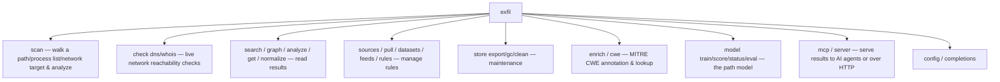
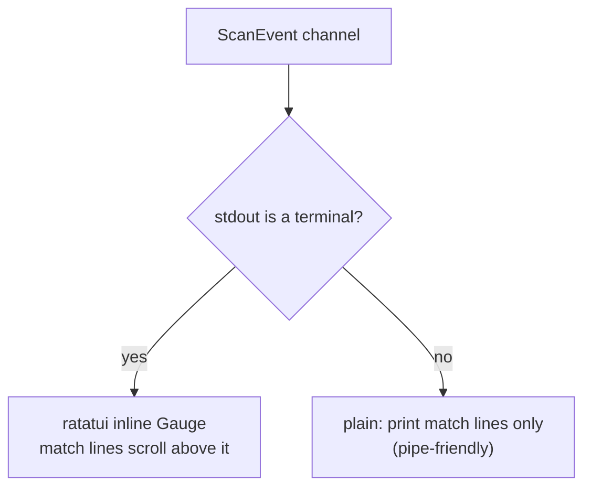

# 7 · The CLI (`exfil-cli`)

← [The graph store](./store.md) · Next: [Integrations →](./integrations.md)

`exfil-cli` is the one **binary** — the executable a user actually runs. It parses
arguments and wires every other crate together. This page maps the commands, then
covers the interactive progress gauge shown during a scan.

Source: [`crates/exfil-cli/src/`](../../crates/exfil-cli/src/) — `main.rs`
(commands) and `progress.rs` (the gauge).

---

## 1. The command surface

`main.rs` uses [clap](https://docs.rs/clap) to declare subcommands. Two global
flags apply to all: `-s/--store` (findings store path, default `.exfil`) and
`-c/--config` (config file).

```mermaid
flowchart TD
    EXF["exfil"] --> SCAN["scan — walk a path/process list/network target & analyze"]
    EXF --> CHECK["check dns/whois — live network reachability checks"]
    EXF --> QUERY["search / graph / analyze / get / normalize — read results"]
    EXF --> DATA["sources / pull / datasets / feeds / rules — manage rules"]
    EXF --> MAINT["store export/gc/clean — maintenance"]
    EXF --> ENR["enrich / cwe — MITRE CWE annotation & lookup"]
    EXF --> RANK["model train/score/status/eval — the path model"]
    EXF --> SERVE["mcp / server — serve results to AI agents or over HTTP"]
    EXF --> MISC["config / completions"]
```

| Command | Does | Handler |
|---------|------|---------|
| `scan [target]` | Scan a local path (default), `processes`, `host:port` (banner grab), a host/CIDR with `--ports`, or an `http(s)://` URL; persists findings with live progress | [`main.rs:653`](../../crates/exfil-cli/src/main.rs#L653) (`cmd_scan`) |
| `check dns` | Resolve observed domains, flag reserved/private resolutions | [`main.rs:897`](../../crates/exfil-cli/src/main.rs#L897) (`cmd_check_dns`) |
| `check whois` | WHOIS-check observed domains, flag newly-registered ones | [`main.rs:840`](../../crates/exfil-cli/src/main.rs#L840) (`cmd_check_whois`) |
| `normalize` | Normalize stored findings into CIM events for cross-source correlation | [`main.rs:876`](../../crates/exfil-cli/src/main.rs#L876) (`cmd_normalize`) |
| `search [query]` | Query stored findings (`field=value` or free text) | [`main.rs:1161`](../../crates/exfil-cli/src/main.rs#L1161) (`cmd_search`) |
| `analyze [query] -f <fmt>` | Render a report (`text`/`json`/`markdown`/`junit`/`sarif`) | [`main.rs:1193`](../../crates/exfil-cli/src/main.rs#L1193) (`cmd_analyze`) |
| `graph [query] -f <fmt>` | Emit the findings graph as JSON or DOT | [`main.rs:1205`](../../crates/exfil-cli/src/main.rs#L1205) (`cmd_graph`) |
| `get <id>` | Print one record by id as JSON | [`main.rs:1567`](../../crates/exfil-cli/src/main.rs#L1567) (`cmd_get`) |
| `sources` | List the available dataset source plugins | [`main.rs:928`](../../crates/exfil-cli/src/main.rs#L928) (`cmd_sources`) |
| `pull [ref]` | Fetch datasets: a specific reference, or every configured `[[update]]` | [`main.rs:943`](../../crates/exfil-cli/src/main.rs#L943) (`cmd_pull`) |
| `datasets [list/show/add/rm]` | Manage the catalog dataset rule sets | [`main.rs:998`](../../crates/exfil-cli/src/main.rs#L998) (`cmd_datasets`) |
| `feeds [list/add/rm/show/pull]` | Manage the URL feed catalog and fetch feeds into rule datasets | [`main.rs:1055`](../../crates/exfil-cli/src/main.rs#L1055) (`cmd_feeds`) |
| `rules [filter]` | Show the built-in rules a scan would apply | [`main.rs:1611`](../../crates/exfil-cli/src/main.rs#L1611) (`cmd_rules`) |
| `enrich` | Annotate findings with authoritative MITRE CWE names | [`main.rs:1466`](../../crates/exfil-cli/src/main.rs#L1466) (`cmd_enrich`) |
| `model train\|score\|status\|eval` | Train, inspect and evaluate the path model that ranks what a scan looks at first | [`main.rs:1243`](../../crates/exfil-cli/src/main.rs#L1243) (`cmd_model_train`) |
| `cwe <id>` | Look up a weakness in the local MITRE CWE catalog | [`main.rs:1500`](../../crates/exfil-cli/src/main.rs#L1500) (`cmd_cwe`) |
| `config` | Show the resolved config path and contents | [`main.rs:503`](../../crates/exfil-cli/src/main.rs#L503) (`cmd_config`) |
| `store export -o -f` | Snapshot the store (CBOR or JSON) | [`main.rs:1518`](../../crates/exfil-cli/src/main.rs#L1518) (`cmd_export`) |
| `store gc` | Garbage-collect unreachable records | [`main.rs:1556`](../../crates/exfil-cli/src/main.rs#L1556) (`cmd_gc`) |
| `store clean` | Delete the findings store (keeps downloaded datasets) | [`main.rs:1652`](../../crates/exfil-cli/src/main.rs#L1652) (`cmd_clean`) |
| `mcp` | Serve exfil's whole tool surface over MCP/stdio for AI agents | [`main.rs:482`](../../crates/exfil-cli/src/main.rs#L482) |
| `completions <shell>` | Print a shell completion script | [`main.rs:1603`](../../crates/exfil-cli/src/main.rs#L1603) (`cmd_completions`) |

`main` is `#[tokio::main]` ([`main.rs:406`](../../crates/exfil-cli/src/main.rs#L406))
— async, because the store and network are async. Assembling the scanners from
built-in rules + catalog datasets + ClamAV/YARA files is *not* done here:
`build_pipeline` ([`engine/setup.rs:72`](../../crates/exfil-engine/src/setup.rs#L72))
lives in the engine so the CLI and the [MCP server](./integrations.md) build
identical pipelines.

---

## 2. The progress gauge (`progress.rs`) {#progress}

When you run `exfil scan`, the [engine](./engine.md#9-live-progress-the-scanevent-channel)
streams `ScanEvent`s; `progress.rs` renders them. It picks its renderer based on
whether stdout is a terminal ([`progress.rs:82`](../../crates/exfil-cli/src/progress.rs#L82)):

```mermaid
flowchart TD
    EV["ScanEvent channel"] --> TTY{"stdout is a terminal?"}
    TTY -->|yes| G["ratatui inline Gauge<br/>match lines scroll above it"]
    TTY -->|no| P["plain: print match lines only<br/>(pipe-friendly)"]
```

The interactive path uses a ratatui `Gauge` on an inline 1-line viewport, inserting
each match *above* the moving gauge via `terminal.insert_before`
([`progress.rs:131`](../../crates/exfil-cli/src/progress.rs#L131)) so hits stay in
scrollback while the bar advances. The non-terminal path prints only match lines,
so `exfil scan | grep ...` works cleanly. Both run on a dedicated OS thread and
shut down when the event channel closes.

---

**Next:** [Integrations](./integrations.md) — the MCP server that gives AI agents
the whole tool, process/TCP/web scan sources, and the report formats (including
the [JUnit output](./integrations.md#reporting) for CI).
