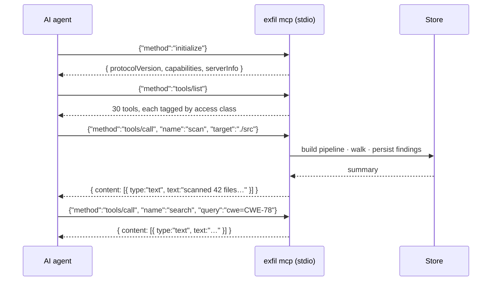
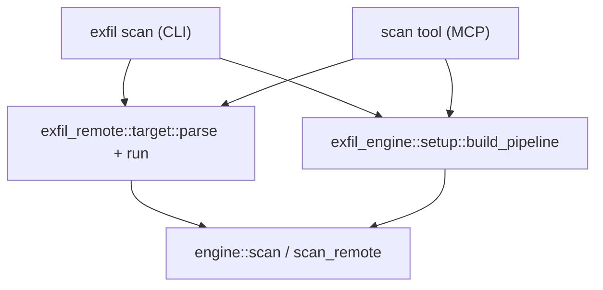
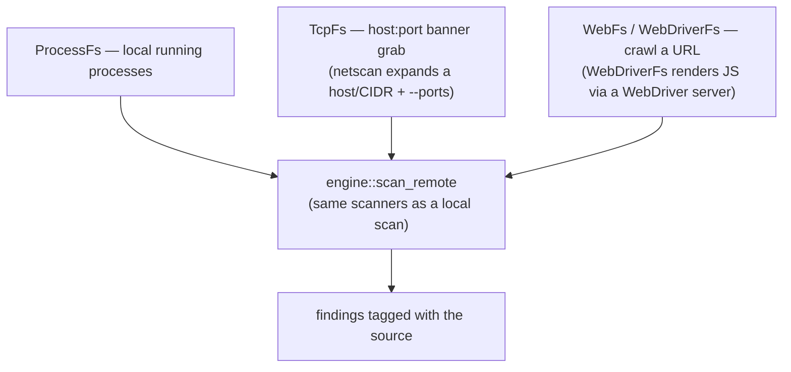
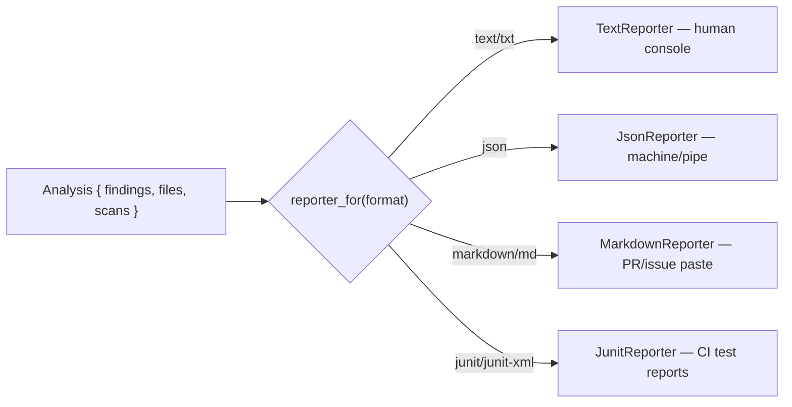
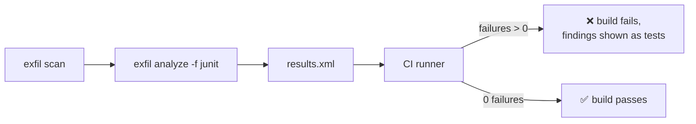
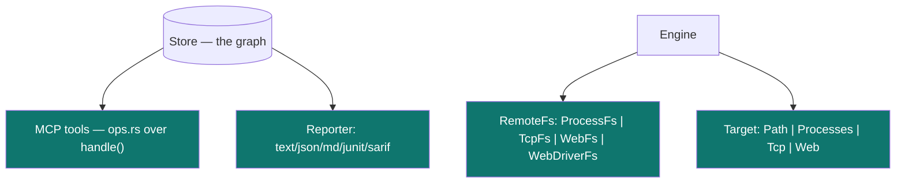

# 8 · Integrations (`mcp` · `remote` · `report`)

← [The CLI](./cli.md) · Next: [Ranked scanning →](./ranking.md)

The final layer is how exfil talks to the outside world: an **MCP server** giving
AI agents the whole tool, **non-local scan sources** (processes, TCP banners, web
crawling), and **reporters** that render findings for humans and CI. Each is a
small crate behind a trait.

---

## 1. MCP server — exfil for AI agents (`exfil-mcp`)

[MCP](https://modelcontextprotocol.io/) (Model Context Protocol) is the standard by
which AI agents call tools. `exfil mcp` runs a JSON-RPC 2.0 server over stdio that
exposes **everything the CLI can do** — not just reading the findings graph, but
scanning, managing the catalog, running post-scan passes, and maintaining the
store. An agent (like Claude) can drive a whole investigation: scan a tree, query
what it found, follow the graph, and render a report.

Source: [`crates/exfil-mcp/`](../../crates/exfil-mcp/) — split three ways.

| Module | Role |
|--------|------|
| [`lib.rs`](../../crates/exfil-mcp/src/lib.rs) | The JSON-RPC protocol: `initialize`, `tools/list`, `tools/call` |
| [`tools.rs`](../../crates/exfil-mcp/src/tools.rs) | The tool catalog — schema + access class + dispatch |
| [`ops.rs`](../../crates/exfil-mcp/src/ops.rs) | What each tool actually runs |

The design splits the *logic* from the *I/O* so it's testable:

- `handle(ctx, req)` ([`mcp/lib.rs:35`](../../crates/exfil-mcp/src/lib.rs#L35))
  is a pure function: one JSON request in, one JSON response out (or `None` for a
  notification — a request with no `id`, dropped via the `?`-on-`Option` idiom).
- `serve(ctx)` ([`mcp/lib.rs:88`](../../crates/exfil-mcp/src/lib.rs#L88)) is
  the thin stdio loop: read a line, parse JSON, call `handle`, write the response.

### The context, not a connection

`serve` takes a `Ctx { store_dir, config }`
([`mcp/ops.rs:29`](../../crates/exfil-mcp/src/ops.rs#L29)) rather than an already
open `Store`, and every operation opens what it needs and drops it on return. That
costs a little per call and buys two things a long-lived handle can't give you:
`clean` can delete the store directory without a live handle writing into unlinked
files, and a `pull` is visible to the very next `scan` with no cache to invalidate.

### The 30 tools

Tools are grouped by **access class**, which is prefixed to every advertised
description ([`mcp/tools.rs:21`](../../crates/exfil-mcp/src/tools.rs#L21)) so an
agent — and whoever reads its transcript — can see the consequence *before* the
call, not after:

| Tag | Meaning |
|-----|---------|
| `[read-only]` | Reads stored state; changes nothing |
| `[writes to the local store]` | Writes to the findings store or catalog |
| `[network: reaches remote systems]` | Opens outbound connections |
| `[DESTRUCTIVE: deletes stored data]` | Irreversibly deletes stored data |

**Reading the findings graph** — `search`, `graph`, `neighbors`, `get`, `analyze`
(any reporter format), `stats`, `export`.

**Reading the catalog and config** — `rules`, `cwe`, `datasets`, `feeds`,
`sources`, `config`, `plugin_settings`.

**Scanning** — `scan`, taking the same target spec as the CLI: a path,
`processes`, `host:port`, a host/CIDR with `ports`, or an `http(s)://` URL.

**Catalog maintenance** — `pull`, `feed_add`, `feed_rm`, `dataset_rm`,
`plugin_set`.

**Post-scan passes** — `normalize`, `annotate_cwe`, `check_dns`, `check_whois`.

**The path model** — `hmm_train`, `hmm_score`, `hmm_status`, `hmm_eval` (see
[Ranked scanning](./ranking.md)).

**Store maintenance** — `gc`, `clean`.

> **Authorized use.** `scan` with a remote target, `check_dns`, `check_whois`, and
> `pull` all reach out over the network, and `clean` destroys your findings store.
> Exposing them to an agent is a deliberate choice: exfil's answer is to *label*
> them rather than hide them, so consent is informed at the point of the call.

### One catalog, no drift

The tool table pairs each advertised schema with the `ops` call it dispatches to
([`mcp/tools.rs:287`](../../crates/exfil-mcp/src/tools.rs#L287)), so the two cannot
disagree. More importantly, `ops` makes the *same library calls the CLI makes*:

Store opening and pipeline building live in
[`exfil_engine::setup`](../../crates/exfil-engine/src/setup.rs); scan-target
resolution lives in
[`exfil_remote::target`](../../crates/exfil-remote/src/target.rs). Neither front
end owns them. That is what makes "an agent-run scan applies exactly the ruleset a
shell-run scan would" a structural fact rather than a promise.

### Two error layers

An *unknown tool* is a JSON-RPC error (protocol-level), but a *tool that ran and
failed* returns `isError: true` MCP content
([`mcp/lib.rs:65`](../../crates/exfil-mcp/src/lib.rs#L65)) — visible to the agent
as a result, not a transport failure. That distinction is what lets an agent see
"your query was malformed" and adapt, without the connection dying.

---

## 2. Non-local scan sources (`exfil-remote`) {#remote}

`exfil scan` dispatches on the shape of its target: the literal `processes`, a
`host:port` (or a host/CIDR swept with `--ports`), or an `http(s)://` URL all
route to a source in `exfil-remote`, each implementing the engine's
[`RemoteFs`](./engine.md#10-remote-scans-scan_remote) trait.

- `ProcessFs` ([`remote/proc.rs`](../../crates/exfil-remote/src/proc.rs)) lists the
  local host's running processes and presents each one's name, exe path, and
  command line as scannable bytes.
- `TcpFs` ([`remote/tcp.rs`](../../crates/exfil-remote/src/tcp.rs)) connects to each
  `host:port` target and reads back its banner; `netscan::expand_targets`
  ([`remote/netscan.rs`](../../crates/exfil-remote/src/netscan.rs)) turns a host or
  IPv4 CIDR plus a `--ports` spec (list, ranges, or `common`) into that target list.
- `WebFs` / `webdriver::WebDriverFs` ([`remote/web.rs`](../../crates/exfil-remote/src/web.rs),
  [`remote/webdriver.rs`](../../crates/exfil-remote/src/webdriver.rs)) crawl a seed
  URL up to `--max-pages`/`--max-depth`; the WebDriver variant renders each page
  first, for JavaScript-heavy sites a plain HTTP fetch can't see.

Because each implements `RemoteFs`, the scanners "never know the bytes came from
the network" — the exact same [pipeline](./pipeline.md) runs regardless of source.

> SSH/SFTP remote-host scanning (walking another machine's filesystem by logging
> into it) was removed — these sources reach a target's processes, ports, or
> served pages, not its filesystem.

---

## 3. Reporting (`exfil-report`) {#reporting}

Reporters turn an `Analysis` (findings + store counts) into output. Each format is
a `Reporter` ([`report/lib.rs:72`](../../crates/exfil-report/src/lib.rs#L72));
`reporter_for(name)` ([`report/lib.rs:82`](../../crates/exfil-report/src/lib.rs#L82))
picks one.

| Format | Use | Notes |
|--------|-----|-------|
| `text` | Console reading | Findings + severity summary + risk score |
| `json` | Piping / tooling | `{ summary, findings }`; `Match`'s own serde shape is the wire format |
| `markdown` | Paste into a PR/issue | Severity + findings tables; pipes in snippets escaped |
| `junit` | **CI gating** | Each finding is a failing `<testcase>`; a clean scan is a passing suite |

The **JUnit** reporter ([`report/lib.rs`](../../crates/exfil-report/src/lib.rs),
`JunitReporter`) is built for CI: runners like Jenkins, GitLab CI, and GitHub
Actions ingest JUnit XML natively, so `exfil analyze -f junit > results.xml` lets a
pipeline **fail the build on findings** and show each one as a failed test. Every
XML metacharacter in rule names, messages, and snippets is escaped so a crafted
snippet can't break the document. Zero findings → `tests="0" failures="0"` → the
build goes green.

The trait writes to any `&mut dyn Write` — a file, stdout, or an in-memory buffer —
which is how every reporter is tested without touching the filesystem
([`report/lib.rs:8-11`](../../crates/exfil-report/src/lib.rs#L8)).

---

## 4. How it all connects

Every integration in this section is a **trait implementation** plugging into a
seam the rest of exfil already defined:

- `Reporter` (report), `RemoteFs` (remote), `Source` (source), `FileTask`
  (task) — all the same pattern: **define a trait, implement it, register it.**
- The MCP server is the one that inverts it: rather than adding a seam, it *reuses*
  every existing one, which is why exposing the full surface cost a tool table and
  not a second implementation of anything.
- That is the through-line of the whole architecture. Once you've seen
  [`FileTask`](./pipeline.md), every other extension point reads the same way.

---

**Next:** [Ranked scanning](./ranking.md) — the path model that decides what a
scan looks at first, work budgets, and the ruleset fingerprint that keeps an
incremental scan honest.
