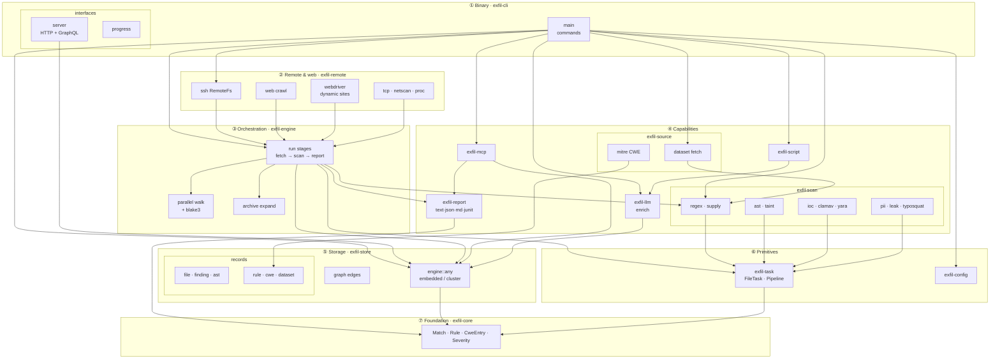
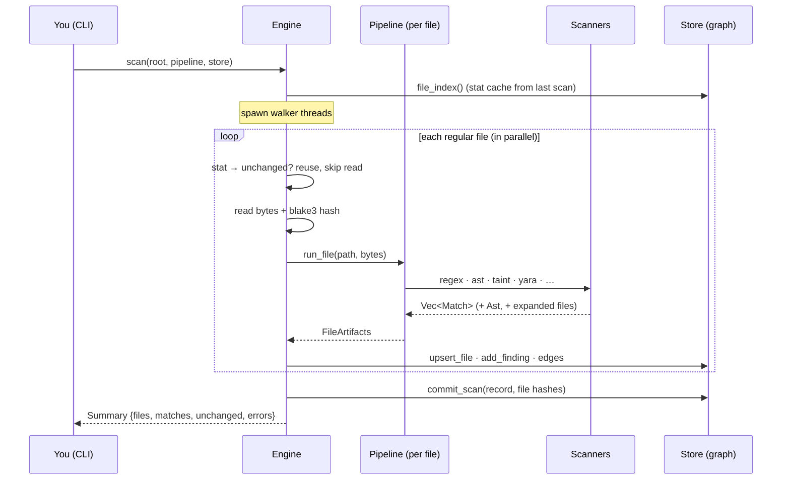

# 0 · Overview, Layers & File Structure

← [Back to index](./README.md) · Next: [The plugin DAG →](./pipeline.md)

This page gives you the map before the territory: the repository's **file
structure**, the **layers** the code is organized into, how the crates **depend**
on each other, and the **end-to-end flow** of a single scan. Later pages zoom
into each box.

---

## 1. Why a Cargo *workspace* of many crates?

exfil is not one big program — it is **12 small libraries plus one binary**,
assembled in a *Cargo workspace*. A workspace is a set of related packages
("crates") that share one `Cargo.lock`, one `target/` build directory, and one
set of lint rules, but compile as separate units.

> **Rust term — crate.** A *crate* is the unit of compilation and distribution in
> Rust, like a package/module in other languages. A crate is either a *library*
> (code other crates use) or a *binary* (an executable). See the
> [Rust primer](./rust-primer.md#crates-and-modules).

Why split one tool into 13 crates? Three concrete payoffs:

1. **Enforced layering.** A crate can only use another crate if it explicitly
   depends on it. `exfil-core` depends on *nothing*, so nothing in the core
   types can accidentally reach into the database or the UI. The compiler
   enforces the architecture — you cannot create a dependency cycle between
   crates.
2. **Parallel, incremental builds.** Change the CLI and only `exfil-cli`
   recompiles, not the scanner or the database layer.
3. **Clear seams for plugins.** Each analysis capability (regex, AST, YARA…)
   lives behind a trait in one crate, so adding one is a local change.

The workspace root [`Cargo.toml`](../../Cargo.toml) declares shared settings that
every crate opts into:

```toml
[workspace.lints.rust]
missing_docs = "warn"      # every public item must be documented
unsafe_code  = "deny"      # this codebase forbids `unsafe`
[workspace.lints.clippy]
all = { level = "warn", priority = -1 }
```

Every crate ends with `[lints] workspace = true` to inherit these. **`unsafe_code
= "deny"`** is a strong claim: there is no hand-written unsafe memory access
anywhere in exfil's own code.

---

## 2. The repository file structure

```text
exfil/
├── Cargo.toml            ← workspace manifest: members, shared deps, lint rules
├── Cargo.lock            ← exact resolved dependency versions (committed)
├── LICENSE               ← MIT
├── README.md             ← project front page
├── CHANGELOG.md          ← human-written history of notable changes
│
├── crates/               ← ALL source code lives here, one directory per crate
│   ├── exfil-core/      ← shared vocabulary: Match, Rule, Severity, FileMeta…
│   ├── exfil-task/      ← the plugin DAG: FileTask, Artifact, Pipeline
│   ├── exfil-config/    ← TOML config loading + defaults
│   ├── exfil-store/     ← the SurrealDB graph store (files, findings, edges)
│   ├── exfil-scan/      ← the scanners: regex, ast, taint, yara, clamav, ioc…
│   │   └── src/
│   │       ├── lib.rs        ← regex scanner + default_pipeline()
│   │       ├── ast.rs        ← tree-sitter AST scanner (12 languages)
│   │       ├── taint.rs      ← taint / data-flow analysis
│   │       ├── expand.rs     ← archive expansion (zip/tar/gz)
│   │       ├── ioc.rs        ← IOC hash matching
│   │       ├── supply.rs     ← supply-chain / dependency checks
│   │       ├── clamav.rs     ← ClamAV signature matching
│   │       ├── yara.rs       ← YARA rule matching
│   │       └── builtin.rs    ← built-in secret rules
│   ├── exfil-source/    ← fetch/refresh rule datasets & IOC feeds
│   ├── exfil-engine/    ← ORCHESTRATION: the parallel walk + run stages
│   │   └── src/
│   │       ├── lib.rs        ← scan() / scan_remote(): walk, hash, persist
│   │       └── run.rs        ← RunStage: fetch → scan → report
│   ├── exfil-remote/    ← SSH/SFTP RemoteFs for scanning other hosts
│   ├── exfil-report/    ← render findings as text / json / markdown
│   ├── exfil-mcp/       ← MCP server: expose the graph to AI agents
│   ├── exfil-llm/       ← offline LLM / rule-based finding enrichment
│   ├── exfil-script/    ← Rhai scripting for user triage rules
│   └── exfil-cli/       ← THE BINARY: argument parsing, wiring
│       └── src/
│           ├── main.rs       ← subcommands (scan, search, analyze, gc…)
│           ├── server.rs     ← HTTP + GraphQL server
│           └── progress.rs   ← the scan progress bar
│
├── datasets/             ← example rule/IOC data (gitleaks.json, *.yar, iocs…)
├── docs/                 ← you are here
│   ├── PLAN.md               ← the roadmap / milestones
│   └── architecture/         ← this guide
└── target/               ← build output (git-ignored, regenerated)
```

Every crate follows the same internal shape — the Rust convention:

```text
crates/exfil-<name>/
├── Cargo.toml     ← this crate's own dependencies
└── src/
    └── lib.rs     ← the crate root (or main.rs for the binary)
```

`lib.rs` is the **crate root**: it is the file the compiler starts from, and its
`pub` items are the crate's public API. Larger crates split into more files
(`ast.rs`, `taint.rs`…) declared as modules with `pub mod ast;` inside `lib.rs`.

---

## 3. The layers

The 13 crates stack into layers. **Arrows point "depends on" — always downward,
never up or sideways in a cycle.** That downward-only rule is what keeps the
design honest.

Each box is a crate; the **nested boxes are that crate's own components** (its
internal scope), so you can see both the layering *and* what lives inside each
layer.



**How to read it, top to bottom:**

| Layer | Crates | Responsibility |
|-------|--------|----------------|
| ① Binary | `exfil-cli` | The one executable. Parses arguments, wires every other crate together. Depends on all of them. |
| ② Remote | `exfil-remote` | Implements the engine's `RemoteFs` trait over SSH so a scan can target another host. |
| ③ Orchestration | `exfil-engine` | Drives a whole scan: walk the tree, run the pipeline per file, persist results. The subject of [page 2](./engine.md). |
| ④ Capabilities | `exfil-scan`, `-source`, `-report`, `-mcp`, `-llm`, `-script` | The actual features. Each is independent and plugs into the store or the pipeline. |
| ⑤ Storage | `exfil-store` | The findings graph — SurrealDB. Everything that produces or reads results goes through here. [Page 6](./store.md). |
| ⑥ Primitives | `exfil-task`, `exfil-config` | The plugin-DAG machinery and config loading. `exfil-task` is [page 1](./pipeline.md). |
| ⑦ Foundation | `exfil-core` | The shared types every layer speaks: `Match`, `Rule`, `Severity`, `FileMeta`, `Symbol`, `VirtualFile`. Depends on nothing. |

Notice `exfil-core` sits alone at the bottom depending on nothing, and
`exfil-cli` sits alone at the top depending on everything. That is the signature
of a clean layered design.

---

## 4. The foundation vocabulary (`exfil-core`)

Because every layer speaks these types, learn them first. They live in
[`exfil-core/src/lib.rs`](../../crates/exfil-core/src/lib.rs):

| Type | File:line | What it is |
|------|-----------|------------|
| `Severity` | `lib.rs:29` | `Info < Low < Medium < High < Critical`; `.weight()` (`lib.rs:48`) maps to a risk number (0/1/2/5/10) |
| `Rule` | `lib.rs:66` | One named detection pattern + optional severity/CWE/CVE |
| `Dataset` | `lib.rs:87` | A named `Vec<Rule>` — the unit a source fetches |
| `Match` | `lib.rs:97` | One hit: a rule firing at `path:line:col` with a `snippet` |
| `FileMeta` | `lib.rs:146` | A file's metadata: path, ownership, size, mtime, and its blake3 `hash` |
| `Symbol` | `lib.rs:134` | One AST element: a `kind` ("call"/"function"), `name`, and `line` |
| `VirtualFile` | `lib.rs:125` | Bytes produced *without a disk file* — e.g. an entry expanded from a zip, path `archive.zip!inner` |

Two design choices in these types are worth calling out because they recur
everywhere:

- **Content addressing.** `FileMeta.hash` is a blake3 hash of the file's bytes.
  The store uses this hash *as the record's identity* — two files with identical
  content are the same node. This is why archive expansion and deduplication
  "just work."
- **`mtime` is a `String`.** Odd at first glance, but it keeps stored records
  portable across platforms with different time representations
  (`lib.rs:169`).

`exfil-core` also isolates the only OS-specific logic in
[`platform.rs`](../../crates/exfil-core/src/platform.rs): `ownership()` has
three definitions — one for Unix (`platform.rs:32`), one for Windows
(`platform.rs:47`), one fallback (`platform.rs:53`) — and the compiler picks
exactly one per target via `#[cfg(unix)]` / `#[cfg(windows)]`. See
[conditional compilation](./rust-primer.md#conditional-compilation).

---

## 5. The end-to-end flow of one scan

Putting the layers in motion, here is what happens when you run `exfil scan .`:



Every arrow on that diagram is a later page:

- **`run_file` → scanners** is the [plugin DAG](./pipeline.md).
- **The walk, hashing, and incremental "unchanged?" fast-path** are the
  [engine](./engine.md).
- **`ast` → `taint`** is the [AST scanner](./ast.md) feeding
  [taint analysis](./taint.md).
- **`upsert_file` / `add_finding` / edges** are the [graph store](./store.md).

---

## 6. Where to go next

- To understand **how plugins are scheduled without wiring them by hand**, read
  **[The plugin DAG →](./pipeline.md)**.
- To understand **how the engine drives a whole scan** (parallelism, incremental
  rescans, archives, remote hosts), jump to **[The engine →](./engine.md)**.
- If any Rust syntax above was unfamiliar, the **[Rust primer](./rust-primer.md)**
  explains every idiom this codebase uses.
