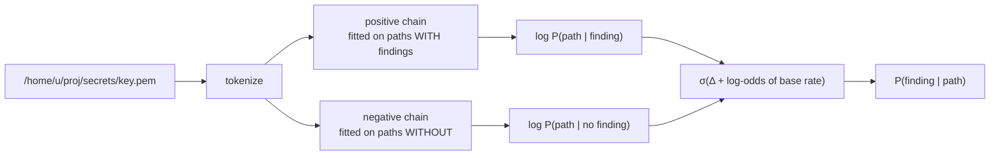
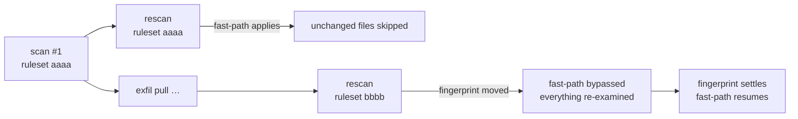

# 9 · Ranked scanning (`hmm` · `plan`)

← [Integrations](./integrations.md) · Next: [Rust primer →](./rust-primer.md)

Everything up to here scans **everything**. This page is about scanning the
*right things first*, and about stopping early without lying about what you did.

Two pieces:

- **`exfil-hmm`** — a hidden Markov model over filesystem paths, trained on the
  scans already in your graph, that estimates `P(finding | path)`.
- **`exfil-engine::plan`** — the [`Budget`](#budgets) and [`ScanPlan`](#the-plan)
  that turn that estimate into an ordering and a stopping rule.

---

## 1. Why a model at all

A scan of a large tree spends most of its time in places that will never yield
anything — `node_modules`, build output, vendored copies, documentation. The
information to avoid that is already sitting in the graph: every previous scan
recorded which files carried findings and which didn't.

That's a labelled corpus. No new scanning, no hand-labelling:

```text
  store                                    training samples
  ┌──────────────────────────┐
  │ file  /home/u/p/key.pem  │◄── in_file ──┐   ("/home/u/p/key.pem",  true)
  │ file  /home/u/p/README   │              │   ("/home/u/p/README",  false)
  │ finding aws-access-key   │──────────────┘   …
  └──────────────────────────┘
```

`Store::training_paths()` returns exactly that: every recorded file's path,
paired with whether any finding was ever attached to it.

> **Caveat worth knowing.** `file` records are keyed by content hash, so files
> with *identical content* collapse to a single record with one arbitrary path.
> Training samples are therefore distinct **contents**, not distinct paths. Real
> trees are mostly unique so this is survivable, but duplicated content
> (vendored libraries, repeated headers) contributes once rather than many times.

---

## 2. Why a *sequence* model

A path is not a bag of words. `.ssh` under a user's home means something quite
different from `.ssh` under `/tmp/build-1234`, and only a model that conditions
on what came before can tell them apart. That conditioning is the entire
argument for a Markov chain over a simple frequency table — and it is worth
measuring, because a bag-of-components baseline is thirty lines and will capture
a surprising fraction.

The tokenizer ([`hmm/lib.rs`](../../crates/exfil-hmm/src/lib.rs)) lowercases each
path component and replaces the **filename with its extension**:

```text
  /home/tsd/proj/secrets/report-2024-final.pem
   home   tsd   proj   secrets   <ext:pem>
```

Filenames are near-unique, so they carry almost no transferable signal and would
bloat the vocabulary. `.pem` means something everywhere;
`report-2024-final.pem` means something only here.

---

## 3. Two chains, not one {#two-chains}

This is the part that took two attempts, and the failure is instructive.

**The first design** fitted one chain over all paths and read a per-state risk
off it: `P(finding | state)` estimated from the labels, then
`score = Σ γ(i)·risk[i]`. It scored `secrets/` and `vendor/` *identically*.

That is not a bug that can be patched. **Baum-Welch maximises likelihood, and
the labels take no part in fitting.** A single state that emits `secrets`,
`docs` and `vendor` with equal probability is a perfectly good model of the
corpus — the likelihood objective has no reason to prefer separating them. Once
the model has collapsed them into one state, no read-out over states can pull
them apart.

The fix is the standard one for a generative classifier: **one chain per class**,
scored by likelihood ratio. Making the label pick the chain is what gives
training a reason to tell the families apart.



Everything is computed in log space and combined with a logistic: the
likelihoods themselves are astronomically small for a long path, and only their
*ratio* carries meaning.

### Numerical care

Multiplying hundreds of probabilities underflows `f64` to zero within a few
dozen steps, which would silently return a score of zero for any deep path. The
forward-backward recursions are therefore **scaled** — each timestep normalised,
the scale factors kept to recover the log-likelihood (the standard Rabiner
formulation). Viterbi works in logs for the same reason. A test scans a
400-component path specifically to prove this doesn't regress.

### Determinism

Baum-Welch cannot break symmetry on its own: start every state identical and
they stay identical forever. Rather than an RNG and a seed to thread around,
each state gets a deterministic integer-hash tilt, so **the same corpus always
produces the same model** — a property a test asserts, and one you want when a
model's output influences what gets scanned.

---

## 4. Budgets {#budgets}

`Budget` ([`engine/plan.rs`](../../crates/exfil-engine/src/plan.rs)) parses from
a suffixed string, so one flag covers every unit:

| Input | Meaning | Reproducible? |
|---|---|---|
| `20%` | fraction of files found | yes |
| `2000` | file count | yes |
| `500mb` | bytes read | yes |
| `30s`, `5m`, `1h` | wall-clock | **no** |

Percentages and counts are deterministic and safe for CI. A time budget isn't —
two runs on the same commit scan different sets — which is why the resulting
file set is recorded in the scan record: non-deterministic when it happens, but
auditable afterwards.

Ranking is by **expected value, not probability**:

```text
                P(finding | path)
   value  =  ─────────────────────       cost floored at one filesystem block
                   cost(bytes)
```

A 2 GB disk image at p=0.9 is worse value than five hundred dotfiles at p=0.3.
It's a greedy knapsack by ratio.

---

## 5. The plan, and the two-phase walk {#the-plan}

`ScanPlan { model, budget, ruleset }` is what a front end hands the engine. With
neither a model nor a budget, the engine takes the ordinary streaming walk —
there is nothing to order and nothing to stop, and the simpler path is faster.

With either, it switches to a two-phase walk:

```text
  ordinary                ranked
  ────────                ──────
  walk ──► process        walk ──► score      (stat only, no reads)
           each file                ↓ sort by value/cost
           as found              process in order, stopping on budget
```

The scoring pass **replaces** the old `count_files` pre-walk rather than adding
to it — that traversal already existed purely to give the progress gauge a
denominator, so ranking costs no extra walk.

### Changed files always win

The ordering is lexicographic, not one score:

```text
  rank 1   changed / new files    ← the stat index knows these exactly
  rank 2   unchanged files        ← ordered by model value
```

Only changed files can produce *new* findings, and the stat index knows which
they are with certainty. **No prior beats a fact.** The model decides the order
within each group, not between them.

---

## 6. Saying what you didn't do

A scanner that covers 20% and prints `0 findings` is dangerous if the output
reads like a clean scan. Three rules enforce that it can't:

1. **The summary states coverage.** `Summary::is_partial()` and `coverage()`
   drive a line naming how many files were examined, how many weren't, and
   whether the order was probability-ranked or merely walk order.
2. **`--budget` and `--fail-on` cannot be combined.** Clap rejects it. A green
   CI badge from a 20% scan is a lie, and the cleanest way not to tell it is to
   make it unrepresentable.
3. **The MCP `scan` tool** appends an explicit *"absence of findings does not
   mean the target is clean"* to any partial result, because an agent reading
   tool output has even less context than a human reading a terminal.

There is a fourth, quieter one: `--budget` on a target that can't honour it (a
crawl, a port sweep) **warns** rather than silently running a full scan.

---

## 7. The ruleset fingerprint {#fingerprint}

Ranking and budgeting made an existing bug much sharper, so it was fixed
alongside them.

The stat fast-path skips a file whose size and mtime match the last scan. That
promise only holds **for the rules that produced the stored findings**. Pull a
new dataset, rescan, and every unchanged file stays unexamined by rules that
have never seen it — a silent miss.

`setup::ruleset_fingerprint()` hashes every active rule's name and pattern
(sorted, so merely reordering a dataset doesn't force a rescan). Each scan
records it; when the next scan's fingerprint differs, the fast-path is bypassed,
everything is re-examined exactly once, and the fingerprint settles again.



The same fingerprint is stored on a trained model, so a model fitted under one
ruleset **warns** rather than silently ranking on stale assumptions.

---

## 8. Using it

```sh
exfil scan ./project              # populate the graph first
exfil hmm train                   # fit on what's there
exfil hmm status                  # states, vocabulary, base rate, ruleset
exfil hmm score src/auth/key.pem  # probability + per-component log-odds

exfil scan ./project --ranked        # worst-first, still scans everything
exfil scan ./project --budget 20%    # worst-first, stops at 20%
exfil scan ./project --budget 30s    # …or after 30 seconds
```

Agents reach the same three via the MCP tools `hmm_train`, `hmm_score` and
`hmm_status` ([Integrations](./integrations.md)).

---

## 9. What isn't done

Stated plainly, because a probability that looks authoritative and isn't is
worse than no probability at all:

- **The scores are not calibrated.** On a cleanly separable corpus they saturate
  at 1.0 and 0.0. They *rank* well, which is all the current features need, but
  they should not yet be read as "there is a 90% chance of a finding here". A
  `--confidence` stop condition — scan until the expected yield flattens — is
  the natural next feature and is blocked on fixing this.
- **No recall-at-budget backtest.** The metric that decides whether this feature
  earns its complexity is: *at 20% coverage, what fraction of a full scan's
  findings do you recover?* 20% would mean the model does nothing; a small
  synthetic tree currently gives 18 of 20. Every full scan in your graph is a
  ready-made test set for this, so it's measurable without new machinery.
- **No baseline comparison.** A frequency prior over directory basenames is
  ~30 lines. If it ranks as well as the HMM, the sequence modelling isn't paying
  for itself.

---

**Next:** the [Rust primer](./rust-primer.md) collects every Rust concept these
pages leaned on.
