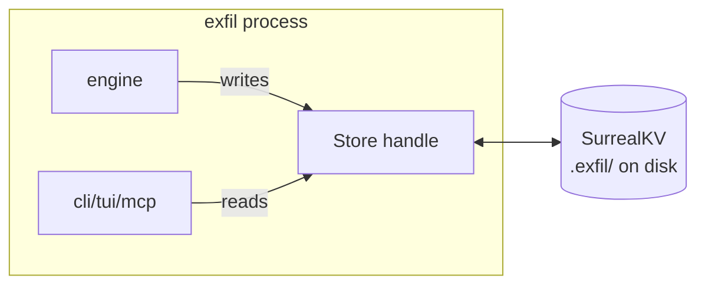
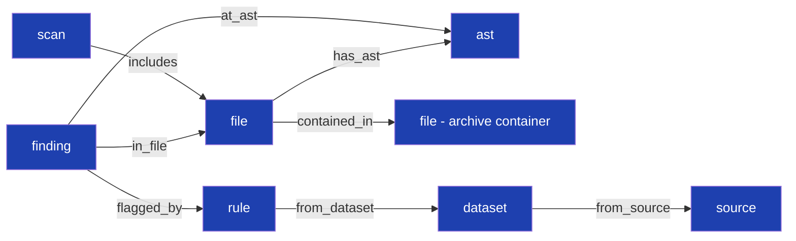
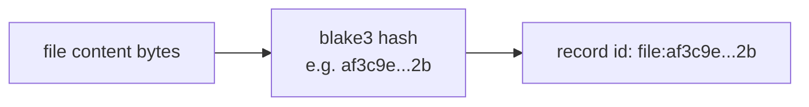
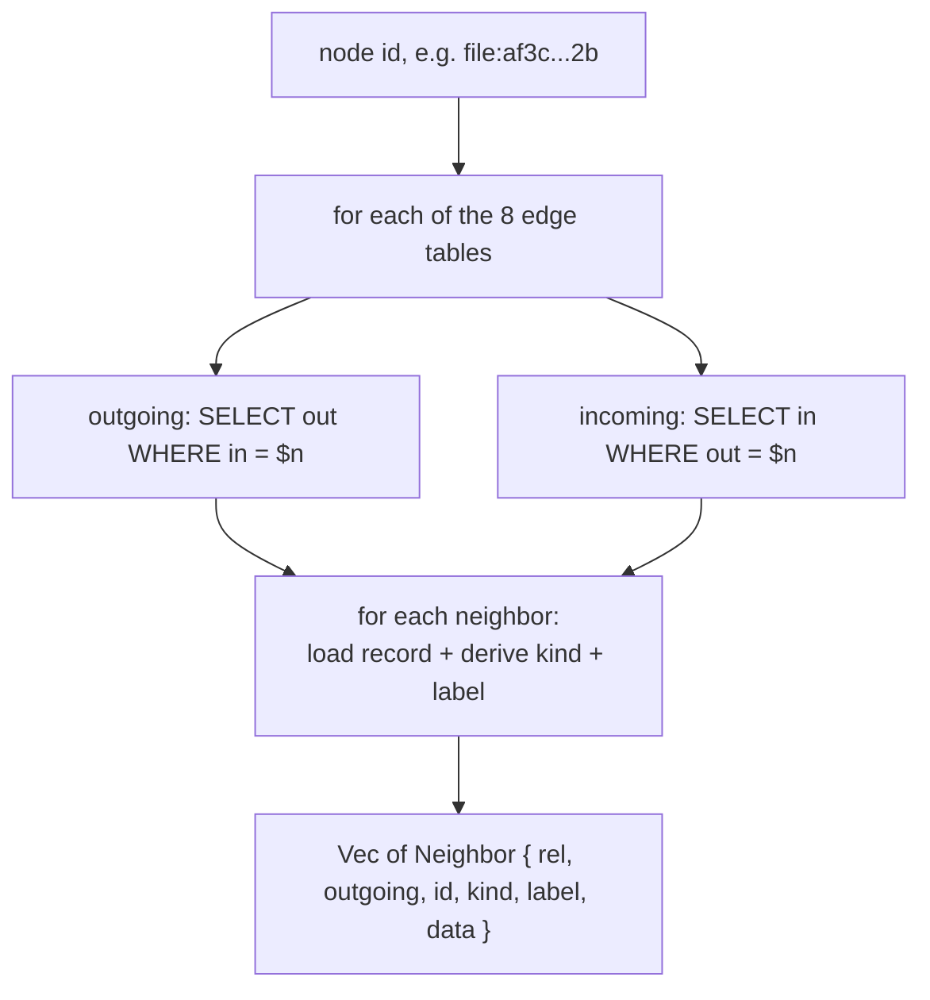
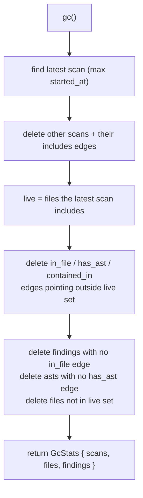

# 6 · The Graph Store (`exfil-store`)

← [The other scanners](./scanners.md) · Next: [CLI, TUI & navigator →](./cli-tui.md)

Everything a scan produces — files, findings, ASTs, datasets, scan records — lands
in one place: an **embedded graph database**. This page explains what that means,
how records are identified by *content*, how the graph edges work, and how garbage
collection keeps the store from growing without bound.

Source: [`crates/exfil-store/src/lib.rs`](../../crates/exfil-store/src/lib.rs)
(1144 lines).

---

## 1. Why a graph database, and why embedded?

exfil's data is naturally a **graph**: a finding is *in* a file; a file *has* an
AST; a file is *contained in* an archive; a scan *includes* files; a rule is *from*
a dataset. Those "is/has/in/from" relationships are edges, and the most useful
questions ("what findings are in files from this archive?") are graph traversals.

So exfil uses [SurrealDB](https://surrealdb.com/) with its **SurrealKV** engine —
a pure-Rust embedded database. "Embedded" means there is no server to run: the
database is a directory on disk (`.exfil/` by default), opened in-process. You
get graph queries and durable storage with zero operational setup — fitting for an
offline tool.

The `Store` type ([`lib.rs:72`](../../crates/exfil-store/src/lib.rs#L72)) wraps the
database handle and is `#[derive(Clone)]` — cloning is cheap because the inner
handle is reference-counted, so it can be shared across threads and async tasks
freely.

Two logical stores share the same code, differing only in database name:

- the **findings** store (`DB_FINDINGS`), your scan results — removed by
  `exfil store clean`;
- the **catalog** store (`DB_CATALOG`), your rule datasets — persistent, located
  via `$EXFIL_CATALOG_DIR`.

---

## 2. The data model: nodes and edges

The schema ([`lib.rs:40`](../../crates/exfil-store/src/lib.rs#L40)) is applied
idempotently on every open (`DEFINE ... IF NOT EXISTS`), so an old store migrates
forward automatically.

**Record tables (nodes):**

| Table | Holds | Identified by |
|-------|-------|---------------|
| `file` | `FileMeta` — path, ownership, size, hash | **blake3 content hash** |
| `ast` | `{ lang, symbols }` | the file's content hash |
| `finding` | `Match` — rule, location, snippet, severity | random id |
| `scan` | `ScanRecord` — root, host, timestamp, counts | random id |
| `dataset` | `{ name, rule count }` | dataset name |
| `rule` | `Rule` — name, pattern, severity | **blake3 of name + pattern** |
| `source` | (reserved for dataset provenance) | — |

**Edge tables (relationships)** ([`lib.rs:51`](../../crates/exfil-store/src/lib.rs#L51)):

That is the whole shape of exfil's world. When the [engine](./engine.md#8-persistence-replace-dont-append)
writes a finding, it creates a `finding` node and an `in_file` edge to the file;
when it stores an AST it adds a `has_ast` edge; when it expands an archive it adds
a `contained_in` edge. The [TUI navigator](./cli-tui.md#navigator) later *walks*
these edges.

---

## 3. Content addressing: identity from bytes

The single most important idea in the store: **a file's record id *is* the blake3
hash of its content** ([`lib.rs:120`](../../crates/exfil-store/src/lib.rs#L120)).

Consequences that ripple through the whole design:

- **Automatic deduplication.** The same content at two paths is *one* node — the
  second `upsert_file` just updates the path. A secret copied into ten files is one
  `file` record, not ten.
- **Archives just work.** A file inside a zip is hashed the same way as a file on
  disk; if they're identical, they're the same node.
- **Rescans are safe.** Editing a file changes its bytes, so it gets a *new* id;
  the old content's record lingers (orphaned) until [gc](#gc). This is why
  findings are keyed by content hash and replaced per-hash, never duplicated.
- **Portable, diffable snapshots.** Two machines scanning the same file produce the
  same ids, so an [exported snapshot](#7-export) diffs cleanly.

Rules are addressed the same way — `rule_id`
([`lib.rs:739`](../../crates/exfil-store/src/lib.rs#L739)) is the blake3 of
`name + "\0" + pattern` — so a rule shared by two datasets is stored once with two
`from_dataset` edges.

---

## 4. How edges work (SurrealQL `RELATE`)

SurrealDB creates a directed edge with `RELATE $from->rel->$to`, which stores an
edge record in table `rel` with `in` (source) and `out` (target) fields. Traversal
uses arrow syntax: `->in_file->file` (outgoing), `<-has_ast` (incoming).

Two idioms recur, and both are documented workarounds for SurrealDB specifics:

- **Idempotent edges via delete-before-relate.** There's no unique-edge
  constraint, so to avoid duplicate edges the code deletes any existing edge before
  re-relating ([`lib.rs:164`](../../crates/exfil-store/src/lib.rs#L164)).
- **Parameters bind *values*, not identifiers.** User input is always passed as a
  bound `$param`, never string-interpolated — so a malicious rule name or search
  term can't alter a query's structure. Where an *identifier* (a field/column name)
  must vary, it is whitelisted or character-validated instead. `set_field`
  ([`lib.rs:554`](../../crates/exfil-store/src/lib.rs#L554)) validates the field
  name is `[A-Za-z0-9_]` before use; `search_findings`
  ([`lib.rs:236`](../../crates/exfil-store/src/lib.rs#L236)) whitelists which
  fields you can filter on. There is a test that a `set_field` injection attempt is
  rejected.

---

## 5. Traversal: `neighbors`, the navigator's engine

The one method the [graph navigator](./cli-tui.md#navigator) is built on is
`neighbors` ([`lib.rs:629`](../../crates/exfil-store/src/lib.rs#L629)): given a
node id, return every directly connected node, tagged with the relationship and
direction.

It checks both directions of all eight edge tables, so from a `file` node you reach
its `ast` (outgoing `has_ast`), its `finding`s (incoming `in_file`), its container
(outgoing `contained_in`), and the scans that included it (incoming `includes`) —
all in one call. Each neighbor gets a human `label` via `node_label`
([`lib.rs:718`](../../crates/exfil-store/src/lib.rs#L718)) for breadcrumbs.

The engine's AST test walks exactly this: from a file it reaches the AST and the
finding, then from the finding hops back to the file
([`engine/src/lib.rs:835`](../../crates/exfil-engine/src/lib.rs#L835)).

---

## 6. Garbage collection {#gc}

Because content addressing leaves orphaned records when files change, `gc`
([`lib.rs:311`](../../crates/exfil-store/src/lib.rs#L311)) prunes everything not
reachable from the **latest scan**:

`gc` is **idempotent** — a second pass removes nothing
([`engine/src/lib.rs:784`](../../crates/exfil-engine/src/lib.rs#L784) asserts a
second `gc()` returns `GcStats::default()`). The timestamp is millisecond-precision
(`started_at`), which matters: an earlier second-resolution version could tie two
scans and pick the wrong "latest."

> **Why keep only the latest scan?** exfil's model is "the current state of this
> tree," not "an audit log of every scan ever." `gc` collapses history to the most
> recent complete picture, reclaiming space from files that no longer exist or have
> changed.

---

## 7. Export snapshots {#export}

`export_snapshot` ([`lib.rs:268`](../../crates/exfil-store/src/lib.rs#L268))
serializes the entire graph — all record and edge tables — into portable JSON
(which the CLI can also emit as [CBOR](./integrations.md)). Because ids are
content-addressed, snapshots from different machines diff meaningfully.

Two SurrealDB-specific details are handled here:

- A `RecordId` doesn't serialize to plain JSON, so ids are stringified with
  `type::string(id) AS rid` ([`lib.rs:279`](../../crates/exfil-store/src/lib.rs#L279)).
- The edge endpoint fields `in`/`out` are SQL reserved words, so they're
  backtick-escaped in the export query
  ([`lib.rs:291`](../../crates/exfil-store/src/lib.rs#L291)).

---

## 8. The store API at a glance

Grouped by what they do (all `async`, all on `Store`):

| Group | Methods |
|-------|---------|
| **Open** | `open`, `open_findings`, `open_catalog`, `apply_schema` |
| **Write scan results** | `upsert_file`, `add_finding`, `clear_findings`, `upsert_ast`, `relate_contained_in`, `commit_scan` |
| **Query findings** | `search_findings`, `graph`, `counts`, `file_index` |
| **Navigate/edit graph** | `neighbors`, `get_record`, `set_field`, `create_edge`, `delete_edge` |
| **Datasets (catalog)** | `upsert_dataset`, `list_datasets`, `get_dataset`, `all_rules`, `remove_dataset` |
| **Maintenance** | `gc`, `export_snapshot` |

`search_findings` ([`lib.rs:236`](../../crates/exfil-store/src/lib.rs#L236)) is the
one you'll use most: empty string returns all findings; `field=value` filters on a
whitelisted field (`rule`/`cwe`/`severity`/`path`); anything else matches against
rule names. It's the same filter syntax the [CLI `search`](./cli-tui.md), the TUI,
and the [MCP `search` tool](./integrations.md) all share.

> **Rust idiom — generics steer the database.** SurrealDB's API is generic over the
> return type; you pick it with a type annotation and serde deserializes the rows:
> `let rows: Vec<FileStat> = res.take(0)?;` ([`lib.rs:139`](../../crates/exfil-store/src/lib.rs#L139)).
> A mismatched annotation is a *runtime* error, so the annotated type must match
> what was stored. See the [primer](./rust-primer.md#generics).

---

**Next:** the [CLI, TUI, and graph navigator](./cli-tui.md) are how a human drives
all of this — running scans, searching findings, and walking the graph with
vim-style keys.
