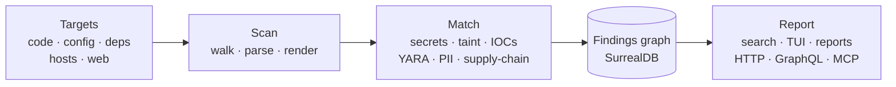

# Introduction

**exfil** — ***EX**amine **F**iles, **I**nfrastructure & **L**ibraries* — is an offline, plugin-based DevSecOps
engine that scans your whole delivery surface for security problems and files
every finding into a queryable graph — so you catch leaked secrets, vulnerable
code, and risky configuration before they ship, with nothing leaving your
machine.

### What it scans

- **Code** — 17 languages via tree-sitter (dangerous calls + taint flow), plus secret/regex rules over any text
- **Infrastructure & config** — Terraform/HCL, Dockerfiles, Kubernetes/YAML
- **Dependencies** — `package.json`, `requirements*.txt`, `Cargo.toml`
- **Archives & container layers** — zip/jar/war/tar/tar.gz/gz, unpacked and scanned in place
- **Hosts** — the local filesystem, remote hosts over SSH, and running processes
- **Web & network** — crawled sites (incl. JavaScript-rendered pages via WebDriver) and TCP service banners

### What it finds and reports

- **Findings** — leaked credentials, code-injection flows, supply-chain risks
  (malicious & typosquatted dependencies), malware signatures (YARA · ClamAV),
  IOCs (bad domains/IPs/hashes), and PII.
- **Stored as a graph** — files → findings → rules in an embedded, pure-Rust
  database ([SurrealDB](https://surrealdb.com)) — or a remote cluster.
- **Reported many ways** — query with `search`, browse the live TUI, render
  `text`/`json`/`markdown`/`junit` reports, gate CI with `--fail-on`, or serve
  the graph over HTTP + GraphQL and to AI agents over MCP. Enriched offline with
  authoritative MITRE CWE names.

## Where to go next

- **New here?** Start with [Installation](guide/installation.md) and the
  [Quick Start](guide/quick-start.md).
- **Day-to-day use** — the [Commands](guide/commands.md) reference, the
  [TUI](guide/tui.md), and [Configuration](guide/configuration.md).
- **What it covers** — [What exfil Analyzes](guide/surfaces.md) and the full
  [Features](guide/features.md) list.
- **How it's built** — the [Architecture Guide](architecture/README.md), a
  multi-page tour written for readers new to Rust.
